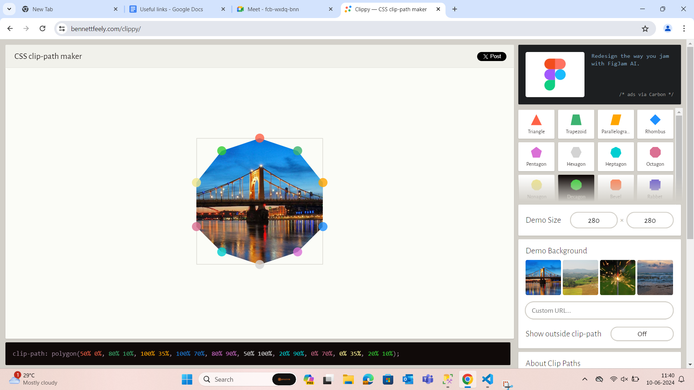
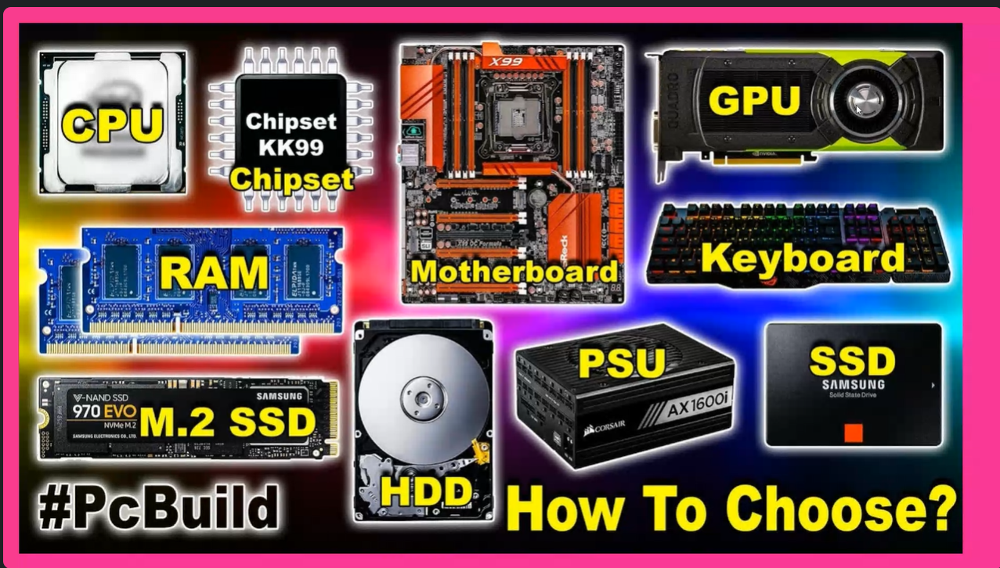
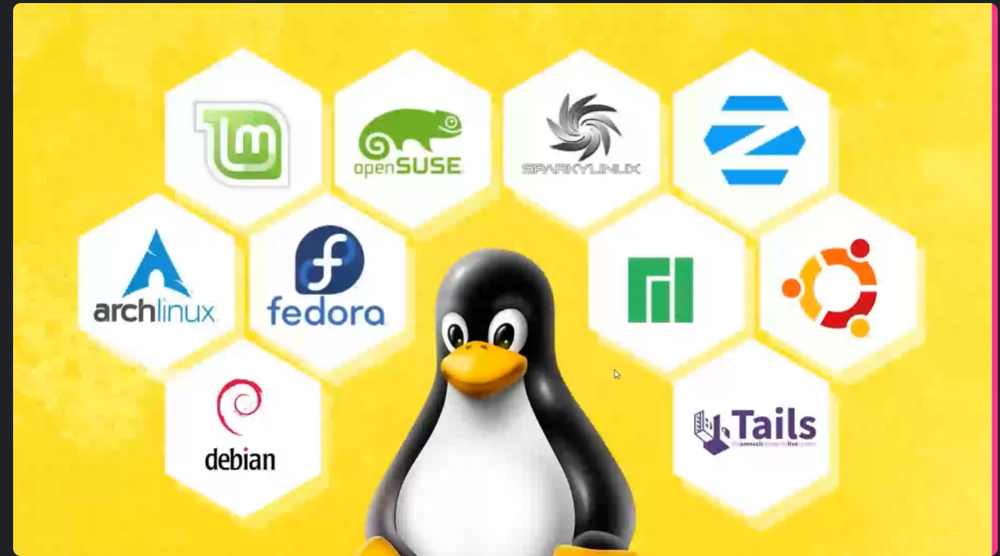
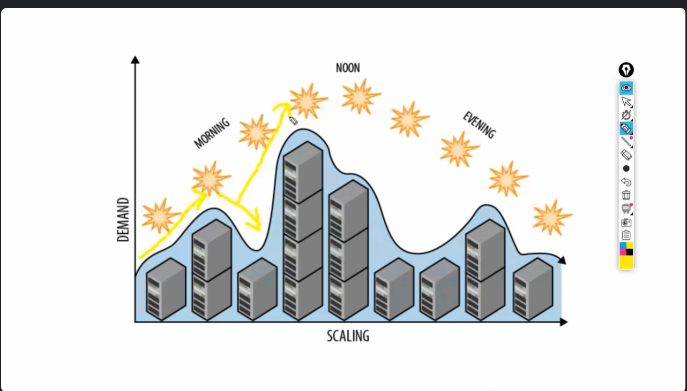
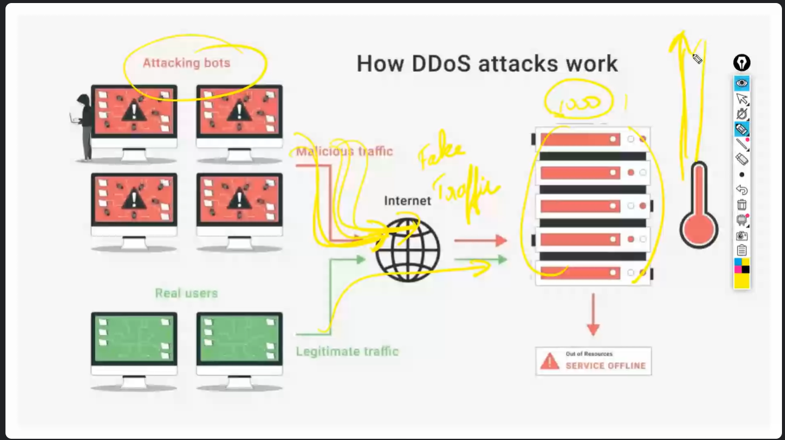
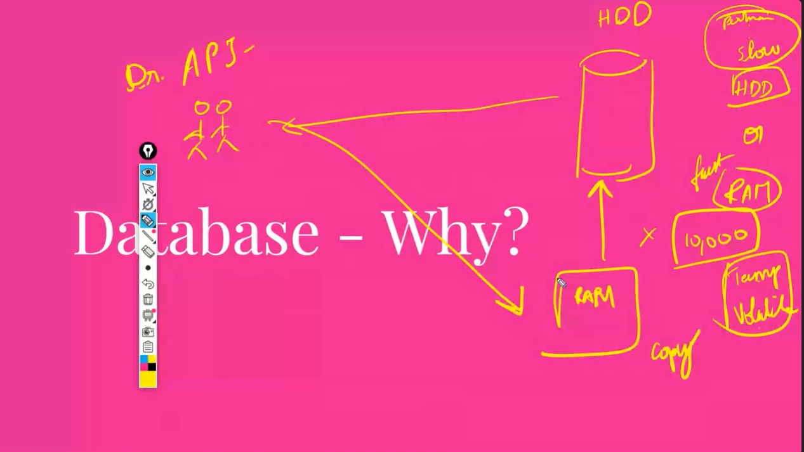
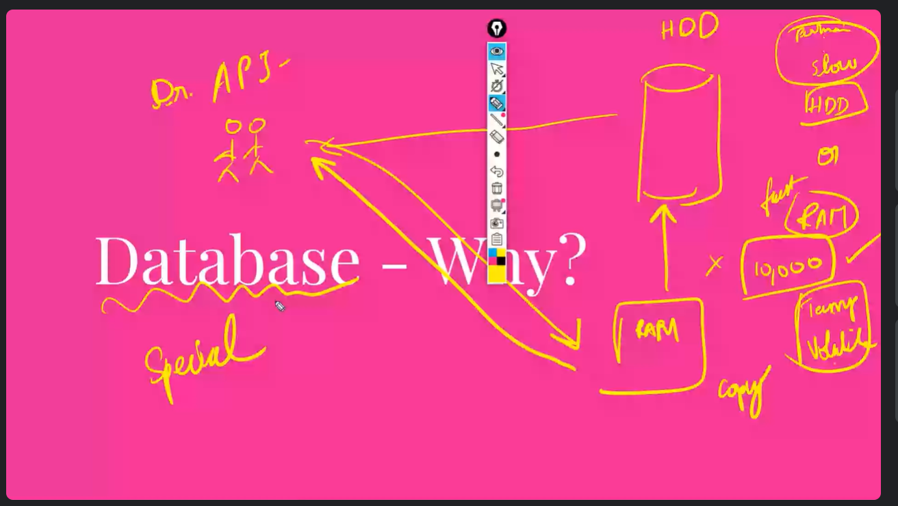
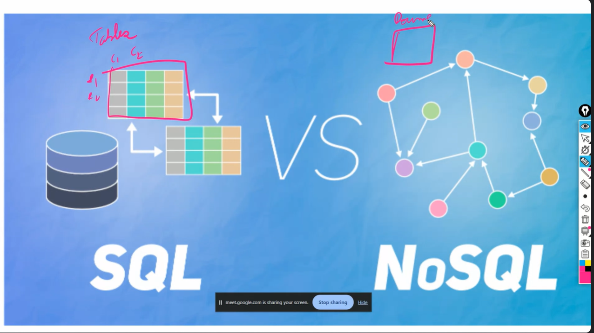

## Default margin and default padding

- By default body,para and list have margin
- By default list has padding in css

- By default border does not get inherited
- By default color will get inherited from the container
- All styling properties related to text styling will get inherited.

## CSS Masking

- Should be given as a styling in CSS.

## Cloud

- GCP,AWS,IBM CLoud, Salesforce, Azure,Alibaba Cloud
- Cloud is rentic PC in short
- All the server racks in the server room contains PC
- What is a Database ?
- Database is a special software which lives in a cloud ( Platform as a service)
- Data migration is the hardest part in SDLC
- Netflix is the biggest customer of AWS
- If hard disk fails the maintainance person can easily swap it with new one containing all the data similar to the old one.
- On the cloud we have linux OS.
- Linux is most used OS.

## CPU

- 

## Linux

- Linux is free and open source
- Advantage of open source is that bugs will be immediately found by the community developers and be fixed because everyone are on the same boat.
- Using dropdown we can select the PC parts and their configuration.
- Secure
- Smaller Footprint
- Windows after installation occupies around 40GB

- Destros/distribution are the various types of Linux
- The one used in cloud is Alphine destro and have very small foot print.
- Vertical scaling is increasing the capacity of server like increasing RAM , better CPU Power we can use.
- Horizontal scaling is used when vertical scaling has reached the maximum limit and now we need to increase the PC's.

## Big Billion days Flipkart 

- When flipkart big billion days are ther load becomes more and cloud providers like AWS have auto scaling they automatically add new PC's and remove after the sale is over.
- Upscaling and downscaling happens automatically.

## How competitiors disturb flipkart during big billion says of flipkart

- Filtering bots using cloudfare
- These pattern questions/captcha tack mouse pattern/touch input in order to verify whether a human is accessing or is it a bot
- IP region identification and blocking
- Divert malicious traffic.

- RAM is 10,000 times faster than Hard disk
- When a game is loading it means that it is copying the level 1 or level 2 which user is playing to RAM from HDD.
- In order to make HDD faster it is replaced with SSD.
- Frequently asked data is stored in the RAM and using database we can fetch the data from RAM or Hard disk

## Features

- Database- Frequently asked data, it will fetch it in the ram
- Querying becomes easier
- CRUD - easy
- Backups are inbuilt 
- Undo - easily ( time limit)
- Performance

## Relational Databases ( SQL )

- PL/SQL , PostgreSQL, MySQL, amazonRDS

## Non-Relational database

- MongoDB, CouchDB, Redis, Cassandra
- Neo 4j,Dynamo DB