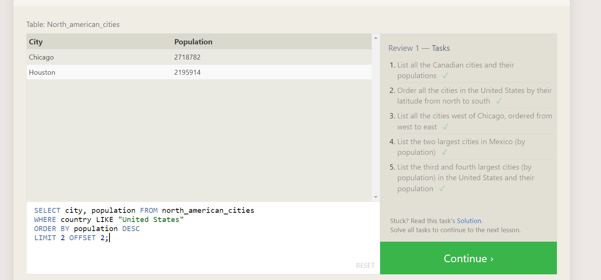

## SQL Excersice

- EX-1 

- SELECT title FROM movies;
- SELECT director FROM movies;
- SELECT title, director FROM movies;
- SELECT title, year FROM movies;
- SELECT * FROM movies;

## Exercise 2

- SELECT *
 FROM movies
 Where id=6;

- SELECT * FROM movies Where year BETWEEN 2000 AND 2010;
- SELECT * FROM movies WHERE year NOT BETWEEN 2000 and 2010;
- SELECT title,year FROM movies WHERE id <= 5;

## Excersice 3

- SELECT title,director FROM movies WHERE title LIKE "%Toy Story%"; 
- SELECT * FROM movies WHERE director LIKE "%John Lasseter%";
- SELECT * FROM movies WHERE director!="John Lasseter";
- SELECT * FROM movies WHERE title LIKE "%WALL%"

## Excersice 4

- SELECT DISTINCT director FROM movies ORDER BY director asc;
- SELECT * FROM movies ORDER BY year DESC LIMIT 4;
- SELECT * FROM movies ORDER BY title ASC LIMIT 5;
- SELECT * FROM movies ORDER BY title ASC LIMIT 5 OFFSET 5;
- 

## Excersice 5

- SELECT city,population FROM north_american_cities WHERE country="Canada";
- SELECT * FROM north_american_cities WHERE country="United States" ORDER By latitude DESC;
- SELECT city, longitude FROM north_american_cities
WHERE longitude < -87.629798
ORDER BY longitude ASC;
- SELECT city, longitude FROM north_american_cities
WHERE longitude < -87.629798
ORDER BY longitude ASC;
- SELECT * FROM north_american_cities WHERE Country="Mexico" ORDER By Population DESC LIMIT 2;
- SELECT city, population FROM north_american_cities
WHERE country LIKE "United States"
ORDER BY population DESC
LIMIT 2 OFFSET 2;

