## Mapping or Injection Table

- In order to divide a database with duplicate Id, name, gender and gmail id we can divide the database into three different tables such that the first table has 

- Separated data is called normalized data and before separation is called as de-normalized data.
- To avoid the anamolies and for storage purposes we are dividing one table into three.

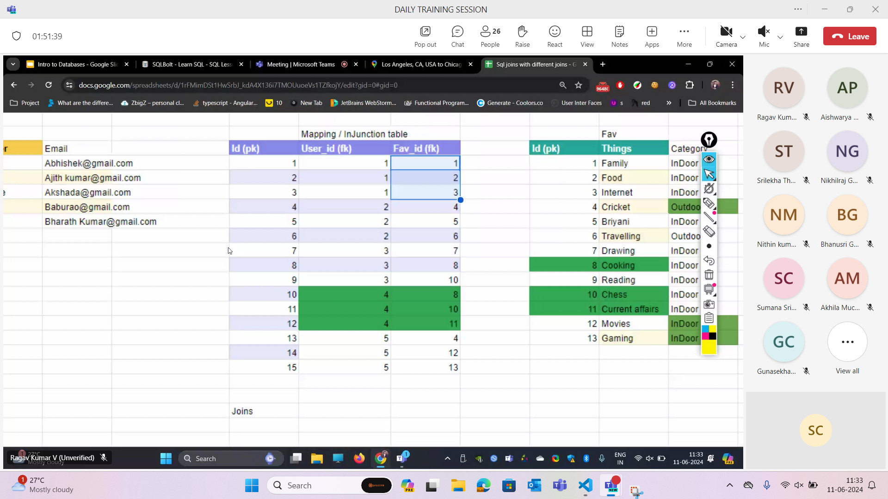](image-39.png)

## Normalization

- It is done to maintain safety of the data.

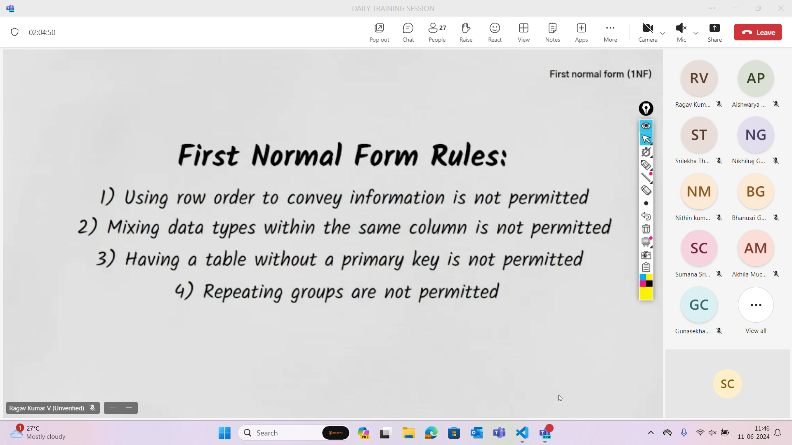

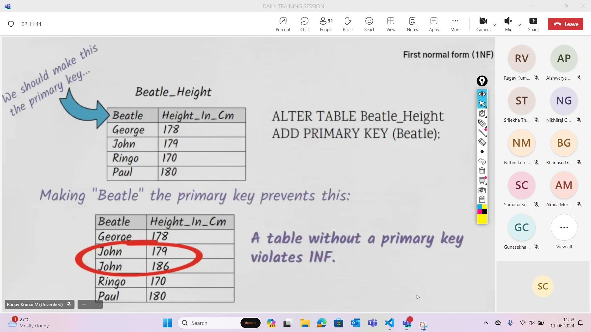

## Question and it's answer with explanation

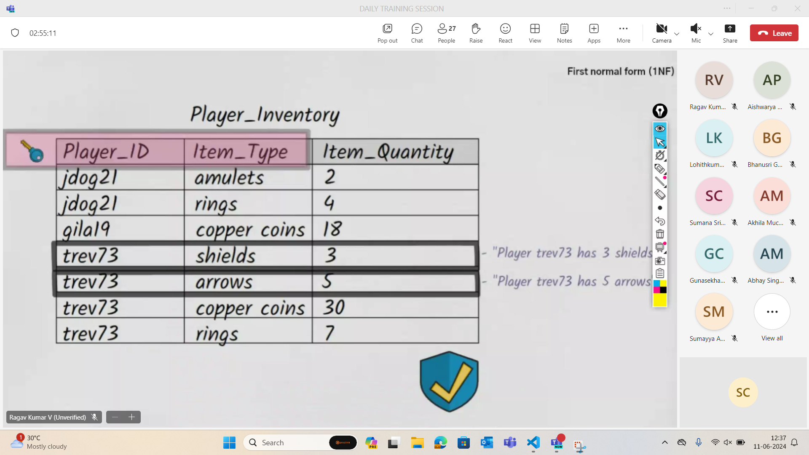

- Here we have to reduce the number of columns and make the table as shown in the image such that we can find the people with greater than 10 copper coins. Here we have the composite key

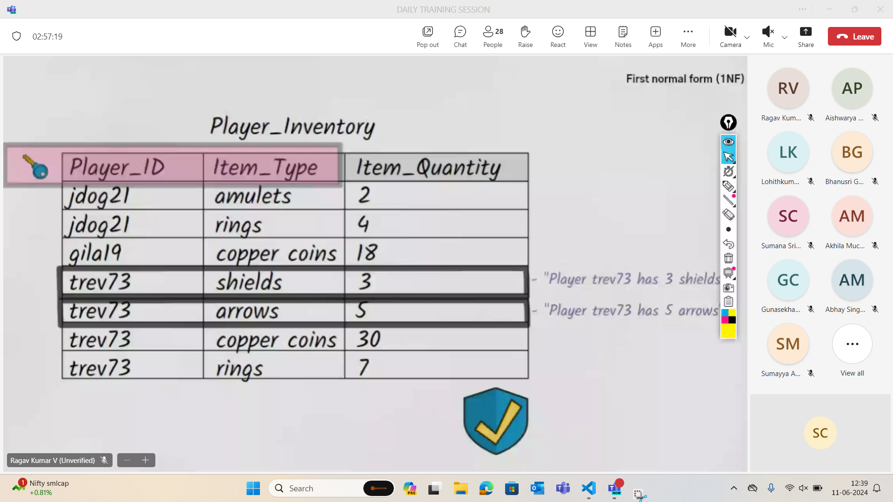

- Further we have insertion,deletion and updation anamoly in the above image so we need to go for normalization 2.

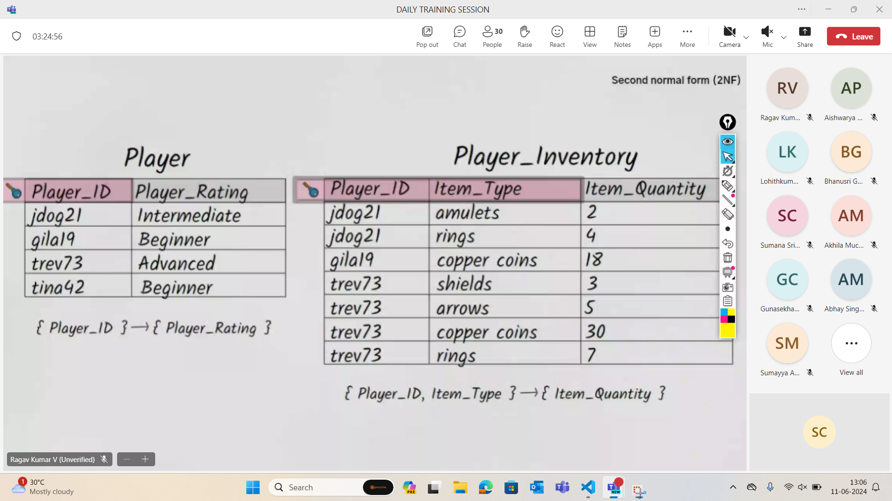

- In the second normal form as shown in the above image we have broken the table into two tables for data safety.

- If the colum is not entirely dependent on th entire primary key then we have to divide it into second noormal form.
- If a table is in second normal form it has to satisfy both first and second normal forms

- Lesser updates more data safety
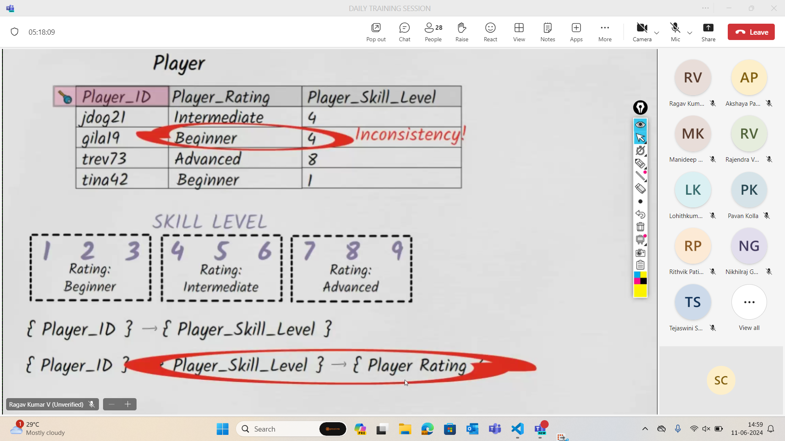

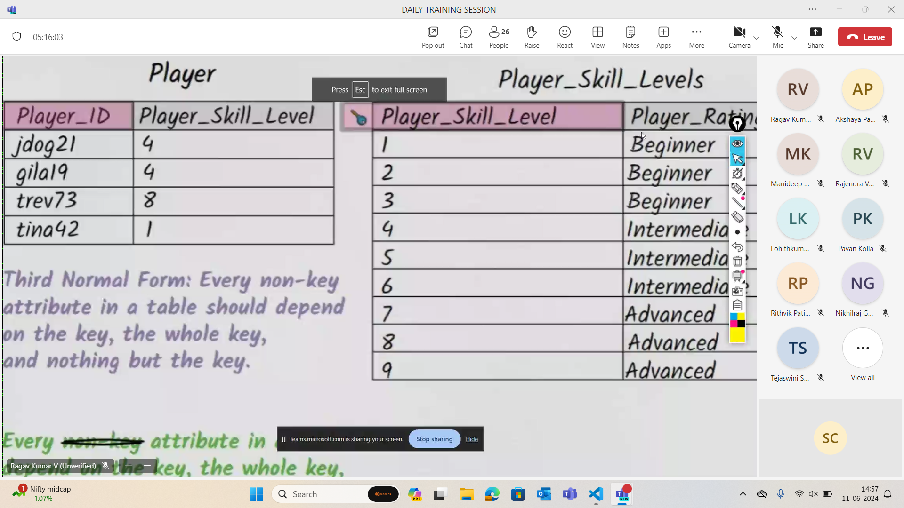

## 3rd normal form rules

- Primary key also should depend on Primary key
## Joins

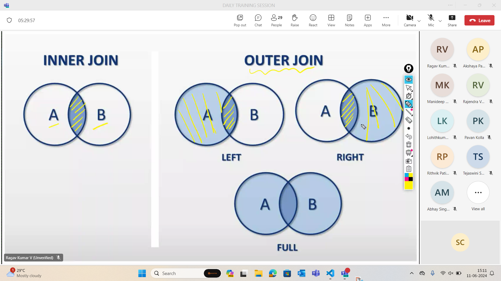

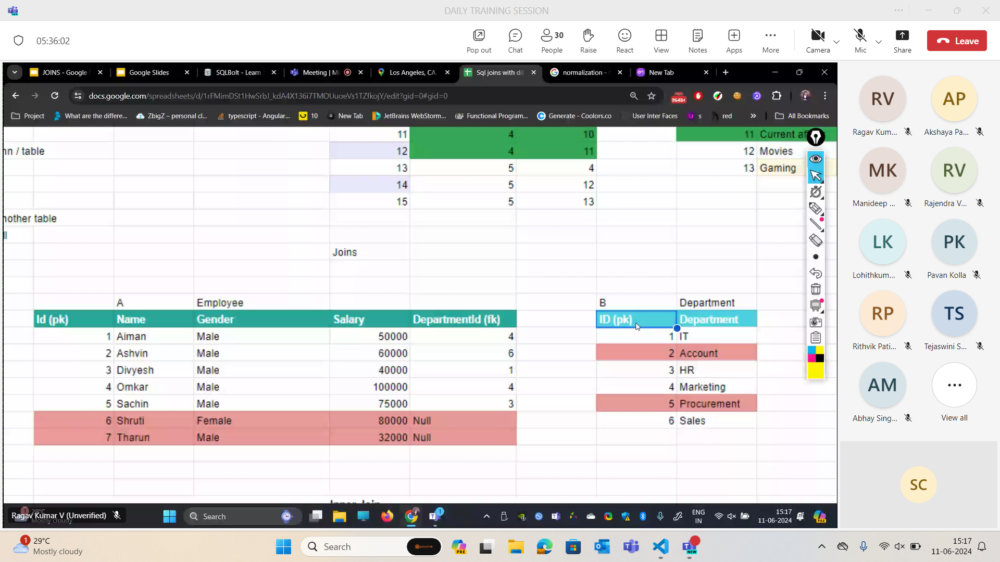

- Inner join - common elements
- Left join extra items of first table - others null
- Right join - extra items of second table - others null
- Full join 

## Excersice - 6

- SELECT * FROM movies INNER JOIN boxoffice ON movies.id = boxoffice.movie_id
- SELECT title, domestic_sales, international_sales
FROM movies
  JOIN boxoffice
    ON movies.id = boxoffice.movie_id
WHERE international_sales > domestic_sales;
- SELECT * FROM movies INNER JOIN boxoffice ON movies.Id=boxoffice.movie_id ORDER BY rating DESC;

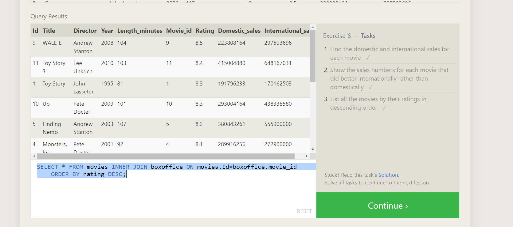

## Excersice - 7

- SELECT DISTINCT buildings from employees;
- SELECT * FROM buildings;
- SELECT distinct building_name,role FROM buildings LEFT JOIN employees ON building_name=building; 

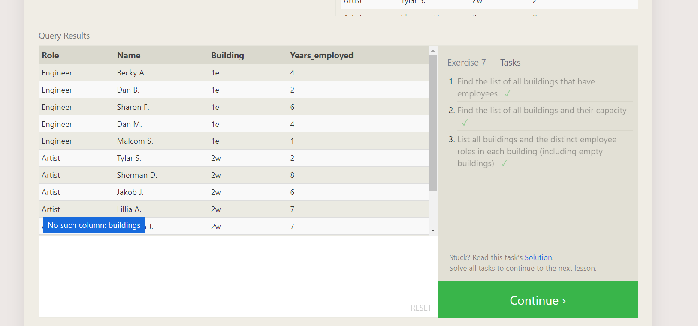

## Excersice - 8

- SELECT * FROM employees WHERE building is NULL;
- SELECT Building_name FROM buildings LEFT JOIN employees ON buildings.building_name=employees.building WHERE employees.name is NULL;

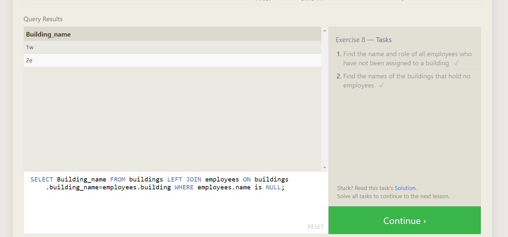

## Excersice 9

- SELECT title, (Domestic_sales + International_sales)/1000000 AS sales
FROM Boxoffice b
INNER JOIN movies m
ON b.Movie_id=m.id;
- SELECT title, (Rating)*10 AS sales
FROM Boxoffice b
INNER JOIN movies m
ON b.Movie_id=m.id;
- SELECT title, year
FROM movies
WHERE year % 2 = 0;

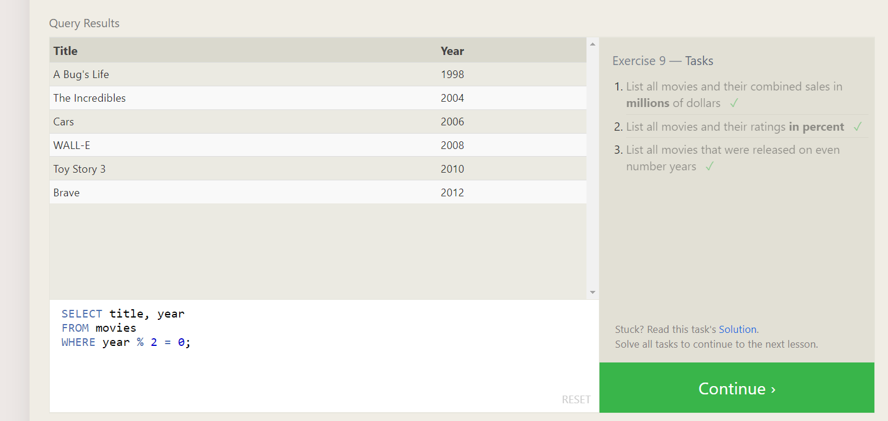

## Excersice 10

- SELECT MAX(years_employed) FROM employees ;
- SELECT role, AVG(years_employed) as ag FROM employees group by role;
- SELECT building, SUM(years_employed) as Total_years_employed
FROM employees
GROUP BY building;

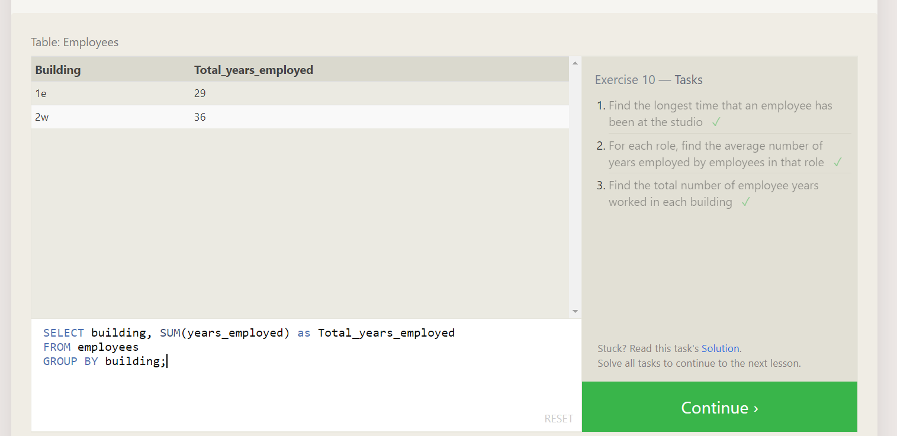

## Excersice 5 

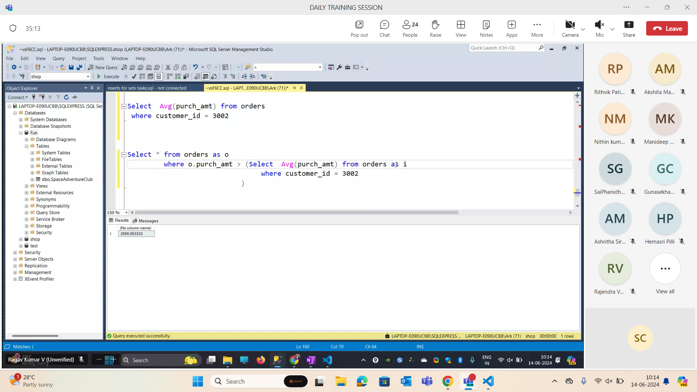

- SELECT * from orders as o 
                where o purch_amt > (Select Avg (purch_amt) from orders as i
                                        where i.customer_id = o.customer_id)

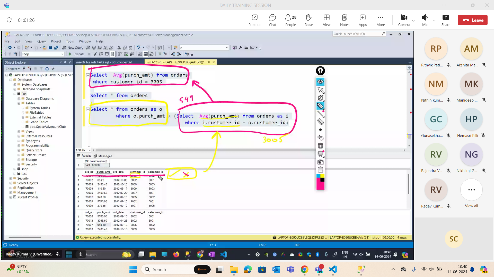 

- This type of sub query is called as co related sub query.
- Subquery is better in terms of readability and has advantages like usage of operators. Joins are better but not good at readability.Sub queries are easier.

## Operators for sub queries

- All
- Any 
- Exists

create database ftrain;

create table training(sno int, day varchar(45), topic varchar(40));

insert into training values (01,'day 01','sql basics');

select * from training

insert into training values (02,'day 02','sql queries');

insert into training values (03,'day 03','data base types');
insert into training values (04,'day 04','ddl & dml commands');
select * from training

CREATE TABLE departments (
    department_id INT PRIMARY KEY,
    department_name VARCHAR(100) NOT NULL
);

CREATE TABLE employees (
    employee_id INT PRIMARY KEY,
    first_name VARCHAR(50) NOT NULL,
    last_name VARCHAR(50) NOT NULL,
    salary DECIMAL(10, 2) NOT NULL,
    department_id INT,
    manager_id INT,
    FOREIGN KEY (department_id) REFERENCES departments(department_id),
    FOREIGN KEY (manager_id) REFERENCES employees(employee_id)
);

INSERT INTO departments (department_id, department_name) VALUES
(1, 'Sales'),
(2, 'HR'),
(3, 'IT'),
(4, 'Finance');

INSERT INTO employees (employee_id, first_name, last_name, salary, department_id, manager_id) VALUES
(1, 'John', 'Doe', 60000, 1, NULL),
(2, 'Jane', 'Smith', 75000, 1, 1),
(3, 'Emily', 'Jones', 50000, 2, NULL),
(4, 'Michael', 'Brown', 55000, 2, 3),
(5, 'Chris', 'Wilson', 95000, 3, NULL),
(6, 'Sarah', 'Taylor', 40000, 3, 5),
(7, 'David', 'Lee', 105000, 3, 5),
(8, 'Paul', 'Walker', 120000, 4, NULL),
(9, 'Laura', 'Hall', 110000, 4, 8);

