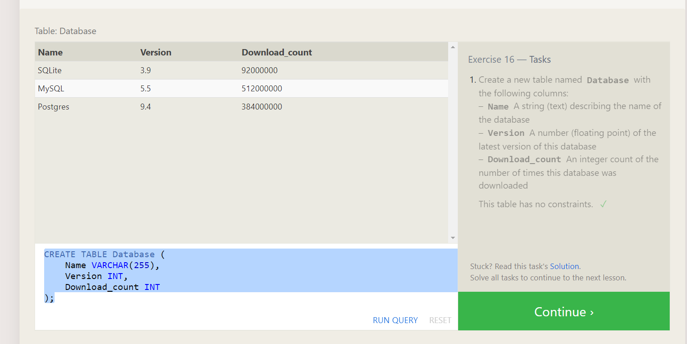

## Group By 

- In order to get the sum of a particular column and if we want to drill down to another level of summarization we can do Group by.

## Excersice - 11

- SELECT role, COUNT(*) as Total_artists
FROM employees
WHERE role = "Artist";
- SELECT role, COUNT(*)
FROM employees
GROUP BY role;
- SELECT role,sum(years_employed) from employees group by role having role="Engineer";

## Excersice 12

- SELECT director, COUNT(id) as Num_movies_directed
FROM movies
GROUP BY director;
- SELECT director, SUM(Domestic_sales + International_sales) as sales from Boxoffice LEFT JOIN Movies ON Movies.id=Boxoffice.movie_id GROUP BY DIRECTOR;

## Excersice 13 

- INSERT INTO movies VALUES (4, "Toy Story 4", "El Directore", 2015, 90);
- INSERT INTO Boxoffice VALUES (4,8.7,340000000,270000000)

## Excersice 14

- UPDATE Movies
SET Director="John Lasseter"
WHERE id=2;
- UPDATE Movies
SET Year="1999"
WHERE id=3;
- UPDATE movies
SET title = "Toy Story 3", director = "Lee Unkrich"
WHERE id = 11;

## Excersice 15

- DELETE FROM Movies
WHERE Year<2005;
- DELETE FROM Movies
WHERE Director="Andrew Stanton";

## Excersice 16

- CREATE TABLE Database (
    Name VARCHAR(255),
    Version INT,
    Download_count INT
);

## Excersice 17

- ALTER TABLE Movies
ADD Aspect_ratio FLOAT
- ALTER TABLE Movies
ADD Language TEXT
DEFAULT English

## Excersice 18 

- DROP TABLE IF EXISTS Movies
- DROP TABLE IF EXISTS Boxoffice

## SQL

- CREATE TABLE salesman (
    salesman_id INT PRIMARY KEY,
    name VARCHAR(255),
    city VARCHAR(255),
    commission DECIMAL(4, 2)
);

Select * from salesman

INSERT INTO salesman (salesman_id, name, city, commission) VALUES
(5001, 'James Hoog', 'New York', 0.15), -- Print
(5002, 'Nail Knite', 'Paris', 0.13),
(5005, 'Pit Alex', 'London', 0.11), -- Print
(5006, 'Mc Lyon', 'Paris', 0.14), -- Print
(5003, 'Lauson Hen', NULL, 0.12),
(5007, 'Paul Adam', 'Rome', 0.13); -- Print

## Q1
- SELECT AVG(commission) as av from salesman where city='Paris'

## Q2
- SELECT city from salesman group by city having count(city)=1;

## Q3
- SELECT ord_no from orders
where salesman_id = (select salesman_id from salesman where name='Paul Adam');

## Q4
- SELECT ord_no from orders where ord_date='2012-10-10' and purch_amt > (select avg(purch_amt) from orders)

## Q5

- select city,count(city)
from salesman
where city is not null
group by city
having count(city)=1;

## Q6

- select orders.ord_no from salesman, orders where city = 'Paris' and salesman.salesman_id=orders.salesman_id;

## Q7

- select distinct s.name, c.salesman_id from salesman s Inner join customer c
On s.salesman_id = c.salesman_id
group by c.salesman_id,s.name
having count(c.salesman_id) > 1;

## DDL and DML

- The DDL commands are CREATE, ALTER, TRUNCATE, RENAME, and DROP. DML commands include SELECT, INSERT, UPDATE, and DELETE. Unlike DML, which is not auto-committed, DDL is. We can undo modifications made to tables in DML, but we cannot do so in DDL.

## What is CHAR data type? 
This data type is used to store characters of limited length. It is represented as char(n) or character(n) in PostgreSQL, where n represents the limit of the length of the characters. If n is not specified it defaults to char(1) or character(1). 

## What is VARCHAR data type? 
This data type is used to store characters of limited length. It is represented as varchar(n) in PostgreSQL, where n represents the limit of the length of the characters. If n is not specified it defaults to varchar which has unlimited length. 

## What is TEXT data type? 
This data type is used to store characters of unlimited length. It is represented as text in PostgreSQL. The performance of the varchar (without n) and text are the same. 