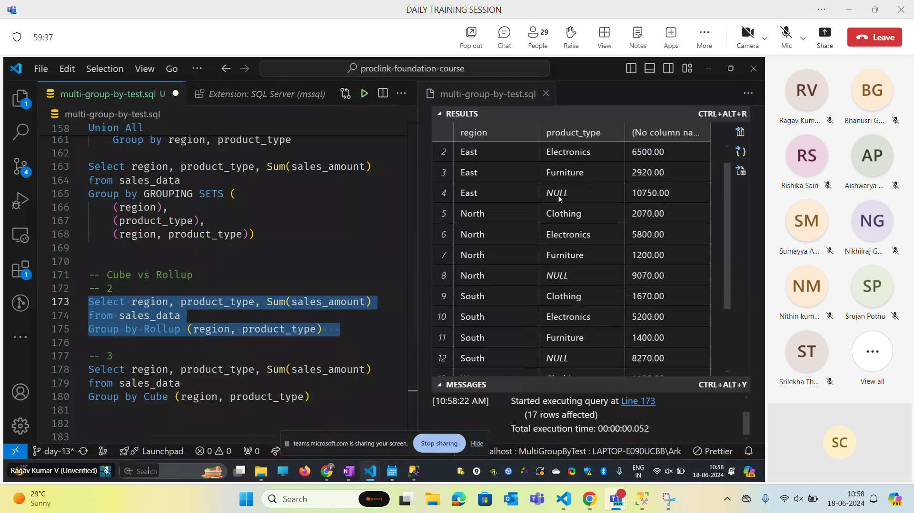

- Cube will give all the possible combinations. if there are n columns we will get n+1 combinations in rollup. For cube we get 2 power n combinations n stands for columns.

- Select product_type

## Rank functions 

- Rank
- Dense_Rank
- Row_Number
- N

- Select * , Rank() OVER (Order by sales_amount desc) from sales_data

## Difference between rank and dense rank 

- In rank if two people get same rank it will skip the next number rank in the sequence but in dense rank it won't skip the next number.

-- Task 1: Region based ranking - Based on Total Sales (Don't skip ranks)

- Select region,product_type,SUM(sales_amount),
DENSE_RANK() OVER ( ORDER BY SUM(sales_amount) DESC) AS Ranking
FROM sales_data
GROUP BY region 
 
-- Task 2: Region based ranking - Based on Total Sales & Total Transactions (Don't skip ranks)
 
- Select region,sales_amount,COUNT(sales_id)
DENSE_RANK() OVER (ORDER BY sales_amount DESC) As Ranking

DENSE_RANK() OVER (ORDER BY sales_id DESC) As Ranking
FROM sales_data
GROUP BY region,sales_amount,COUNT(sales_id)

- CTE can be used to make a temporary table in which we can perform operations.

- Select region,product_type,
FROM sales_data
WHERE Sales_Rank=1

-- CTE

With
    Sales_CTE
    As
    (
        Select region,
        product_Type,
        SUM(sales_amount) as Total_Sales
        RANK() OVER (PARTITION by)
    )

--  Sum,Avg,Count -- Over Clause

Select region,
    product_type,
    SUM(sales_amount) OVER (ORDER by sales_amount)

    | TransactionID| Date       | ProductName | Category  | Price | StoreName     | City           | Country | |---------------|------------|-------------|-----------|-------|-----------    |------------    |---------| | 1              | 2024-04-01 | Laptop      | Electronics | 1200 | TechWorld    | San Francisco  | USA     | | 2              | 2024-04-01 | Smartphone  | Electronics | 800  | TechWorld    | San Francisco  | USA     | | 3              | 2024-04-02 | Jeans       | Apparel     | 40   | FashionFiesta| New York       | USA     | |

