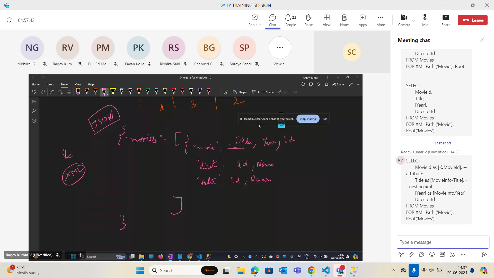

## Assignment 2 solution

    Baahubali	2015		
	Ala Vaikunthapurramuloo	2020	
	Pokiri	2006	
	Magadheera	2009	
	Srimanthudu	2015	
	Arjun Reddy	2017	
	Geetha Govindam	2018
	Temper	2015	
	Eega	2012	
	Attarintiki Daredi	2013

    - Drop Table Actors
DROP TABLE MovieActors
DROP TABLE Movies
DROP TABLE Directors

Create database moviedb
Use moviedb
DROP database moviedb
CREATE DATABASE moviesactors
Use moviesactors
CREATE TABLE Directors(
DirectorId INT Identity(1,1) NOT NULL PRIMARY KEY,
Names VARCHAR(40) NOT NULL,
)

CREATE TABLE Actor(
ActorId INT Identity(20,1) PRIMARY KEY NOT NULL,
Names Varchar(40) NOT NULL,
)

CREATE TABLE Movies(
    MovieId INT Identity(10,1) NOT NULL PRIMARY KEY,
    Title VARCHAR(40) NOT NULL,
    Ryear INT NOT NULL,
    DirectorId INT NOT NULL,
    FOREIGN KEY (DirectorId) REFERENCES Directors(DirectorId)
);

CREATE TABLE MovieActors(
    MovieId INT NOT NULL,
    ActorId INT NOT NULL,
    PRIMARY KEY (MovieId, ActorId),
    FOREIGN KEY (MovieId) REFERENCES Movies(MovieId),
    FOREIGN KEY (ActorId) REFERENCES Actor(ActorId)
);

INSERT INTO Directors VALUES
('S.S.Rajamouli'),
('Trivikram Srinivas'),
('Puri Jagannadh'),
('S.S.Rajamouli'),
('Koratala Siva'),
('Sandeep Reddy Vanga'),
('Parasuram'),
('Puri Jagannadh'),
('S.S.Rajamouli'),
('Trivikram Srinivas');

Insert into Actor values
('Prabhas'),
('Allu Arjun'),
('Mahesh Babu'),
('Ram Charan'),
('Mahesh Babu'),
('Vijay Deverakonda'),
('Vijay Deverakonda'),
('Jr. NTR'),
('Nani'),
('Pawan Kalyan');

Select * from Directors
Select * from Actor
Select * from Movies

INSERT INTO Movies VALUES
   ('Baahubali',2015,1),		
   ('Ala Vaikunthapurramuloo',2020,2),	
	('Pokiri',2006,3),
	('Magadheera',2009,4),	
	('Srimanthudu',2015,5),	
	('Arjun Reddy',2017,6),	
	('Geetha Govindam',2018,7),
	('Temper',2015,8),	
	('Eega',2012,9),
	('Attarintiki Daredi',2013,10);

Select * from Movies

INSERT INTO MovieActors VALUES
(10,20),
(11,21),
(12,22),
(13,23),
(14,24),
(15,25),
(16,26),
(17,27),
(18,28),
(19,29);

ALTER TABLE 

## Keys

## Cross Join

- Natural Join joins based upon the column name

## Task 4 solution

--Task 4: Analyze the yearly growth in sales by region and product type, comparing year-over-year performance.

- select region,product_type,
datepart(year,sales_date) AS sales_year,
sum(sales_amount) AS total_sales
from sales_data 
group by region,product_type, year(sales_date)
order by region, product_type, sales_year;
## Task 3 solution

## Functions in SQL

- String
- Formatting
- Arthimetic
- Ranking 
- Aggregate
