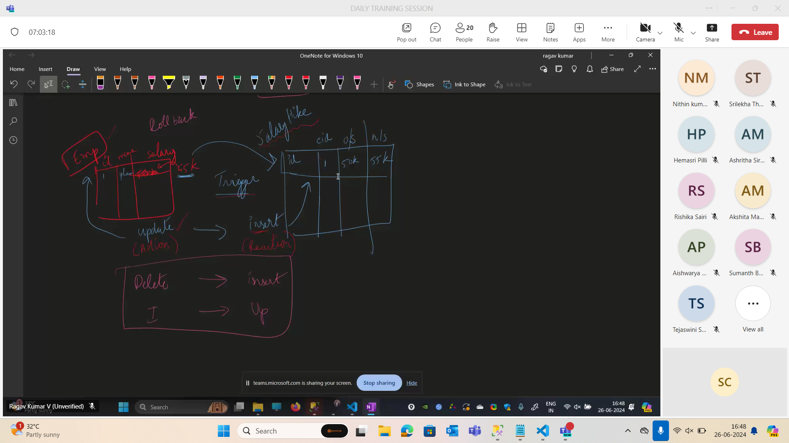
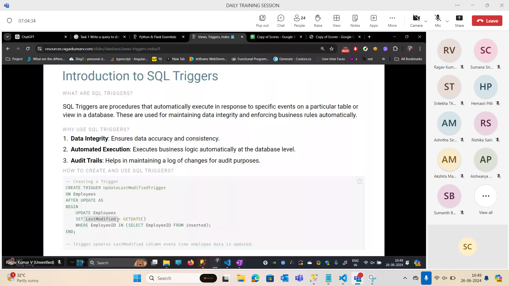
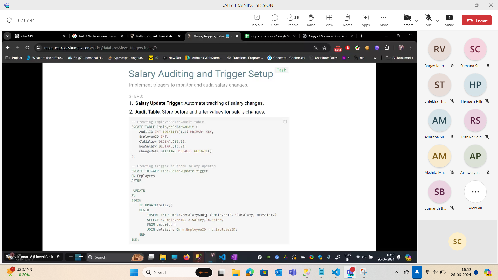

## Triggers

-- Task 1 -- Commit if success | Rollback if failure
Exec spActorChangeOfTitle 'Prabas Rebel Star', 1
 
 
Task - 1
Check if the department exist first if no then error 'No such Department exists' if yes then commit the changes
 
Task 2
Create a Stored Procedure to Update Employee Information with Salary Validation, Department Validation
Make sure the salary should only increase in the range of 10% to 30% of their current salary 

EXEC UpdateEmployeeInfo @EmployeeID = 3, @NewFirstName = 'James', @NewLastName = 'Brown', @NewDepartmentID = 2, @NewSalary = 65000;
 
 
Task 3
Extening the logic of Task 2 also log the transfer that has happened incase of department change in Transfers table
Transfers (EmployeeID, OldDepartmentID, NewDepartmentID, TransferDate)
 
 
Task 4
Reverting an Employee Transfer
`EXEC RevertLastTransfer @EmployeeID = 2`

--- All 4 tasks of stored procedures answers

-- Task 2
-- Create a Stored Procedure to Update Employee Information with Salary Validation, Department Validation
-- Make sure the salary should only increase in the range of 10% to 30% of their current salary
 
GO
ALTER PROC UpdateEmployeeInfo
@EmployeeID INT,
@NewFirstName VARCHAR(30),
@NewLastName VARCHAR(30),
@NewDepartmentID INT,
@NewSalary DECIMAL(10,2)
AS
BEGIN
Declare @OldSalary FLOAT = (SELECT Salary FROM Employees WHERE EmployeeID = @EmployeeID);
Declare @LowHike FLOAT = @OldSalary * 1.1;
Declare @HighHike FLOAT = @OldSalary * 1.3;
    BEGIN TRANSACTION SalValidation
    BEGIN TRY
        IF @NewDepartmentID IN (SELECT DepartmentID FROM Departments)
            THROW 50001, 'Department does not exists',1;
        IF @NewSalary NOT BETWEEN @LowHike AND @HighHike
            THROW 50002,'Salary Hike not in range',1;
        ELSE
            UPDATE Employees
            SET FirstName = @NewFirstName,
                LastName = @NewLastName,
                DepartmentID = @NewDepartmentID,
                Salary = @NewSalary
            WHERE EmployeeID = @EmployeeID
    COMMIT TRANSACTION SalValidation
    END TRY
    BEGIN CATCH
        ROLLBACK TRANSACTION
        PRINT CONCAT('Error Number : ',Error_Number())
        PRINT CONCAT('Error Message : ',Error_Message())
        PRINT CONCAT('Error State : ',Error_State())
    END CATCH
END
GO
 
EXEC UpdateEmployeeInfo @EmployeeID = 3, @NewFirstName = 'James',
                        @NewLastName = 'Brown', @NewDepartmentID = 1, @NewSalary = 50000;
                       
SELECT * FROM Employees
 
 
 
 
 
-- Task 3
-- Extening the logic of Task 2 also log the transfer that has happened incase of department change in Transfers table
-- Transfers (EmployeeID, OldDepartmentID, NewDepartmentID, TransferDate)
GO
 
CREATE TABLE Transfers (EmployeeID INT,
                    OldDepartmentID INT,
                    NewOldDepartmentID INT,
                    TransferDate DATE)
 
GO
ALTER PROC UpdateEmployeeInfo
@EmployeeID INT,
@NewFirstName VARCHAR(30),
@NewLastName VARCHAR(30),
@NewDepartmentID INT,
@NewSalary DECIMAL(15,2)
 
AS
BEGIN
Declare @OldSalary FLOAT = (SELECT Salary FROM Employees WHERE EmployeeID = @EmployeeID);
Declare @LowHike FLOAT = @OldSalary * 1.1;
Declare @HighHike FLOAT = @OldSalary * 1.3;
DECLARE @OldDepartmentID INT = (SELECT DepartmentID FROM Employees WHERE EmployeeID=@EmployeeID);
    BEGIN TRANSACTION SalValidation
    BEGIN TRY
        IF NOT EXISTS (SELECT * FROM Departments WHERE DepartmentId = @NewDepartmentId)
            THROW 50001, 'Department does not exists',1;
        IF @NewSalary NOT BETWEEN @LowHike AND @HighHike
            THROW 50002,'Salary Hike not in range',1;
        ELSE
            IF @NewDepartmentID != @OldDepartmentID
                INSERT INTO Transfers VALUES
                (@EmployeeID,@OldDepartmentID,@NewDepartmentID,GetDate())
                PRINT '1 Record affected'
            SELECT * FROM Transfers WHERE EmployeeID=@EmployeeID
           
 
            UPDATE Employees
            SET FirstName = @NewFirstName,
                LastName = @NewLastName,
                DepartmentID = @NewDepartmentID,
                Salary = @NewSalary
            WHERE EmployeeID = @EmployeeID
    COMMIT TRANSACTION SalValidation
    END TRY
    BEGIN CATCH
        ROLLBACK TRANSACTION
        PRINT CONCAT('Error Number : ',Error_Number())
        PRINT CONCAT('Error Message : ',Error_Message())
        PRINT CONCAT('Error State : ',Error_State())
    END CATCH
END
GO
 
EXEC UpdateEmployeeInfo @EmployeeID = 3, @NewFirstName = 'James',
                        @NewLastName = 'Brown', @NewDepartmentID = 3, @NewSalary = 70000;
 
Go Alter PROCEDURE UpdateEmployeeInfo     @... by Ragav Kumar V (Unverified)
Ragav Kumar V (Unverified)
17:45
Go
Alter PROCEDURE UpdateEmployeeInfo
    @EmployeeID INT,
    @NewFirstName NVARCHAR(50),
    @NewLastName NVARCHAR(50),
    @NewDepartmentID INT,
    @NewSalary DECIMAL(18, 2)
As
Begin
    Declare @OldDepartmentID Int;
 
    Select @OldDepartmentID = DepartmentID
    from Employees
    WHERE EmployeeID = @EmployeeID
 
    Begin Transaction;
    Begin Try
    -- Shield  
    if not Exists (Select *
    from Departments
    Where DepartmentID = @NewDepartmentID)
        throw 60000, 'Department is not present!!!', 1;
 
    if not Exists (Select Salary
    from Employees
    Where EmployeeID = @EmployeeID
        And @NewSalary BETWEEN Salary*1.1 and Salary * 1.3 )
        throw 60000, 'Hike is too much or too less 😅', 1;
    -- Shield  
 
    -- if (@OldDepartmentID != @NewDepartmentID)
    -- INSERT Into Transfers
    -- VALUES
    --     (@EmployeeID, @OldDepartmentID, @NewDepartmentID, GETDATE());
 
      if (@OldDepartmentID != @NewDepartmentID)
      BEGIN
        INSERT Into Transfers
        Select EmployeeID, DepartmentID, @NewDepartmentID, GETDATE()
        from Employees
        Where EmployeeID = @EmployeeID
    END  
 
    UPDATE Employees
    Set FirstName  = @NewFirstName,
    LastName  = @NewLastName,
    DepartmentID  = @NewDepartmentID,
    Salary  = @NewSalary
    WHERE EmployeeID = @EmployeeID;
 
 
 
    Commit Transaction;
    End Try
    Begin Catch
        Rollback Transaction;
        print Concat('Error number is: ', Error_number());
        print Concat('Error message is: ', Error_message());
        print Concat('Error state is: ', Error_State());
    End Catch
End
Go
has context menu