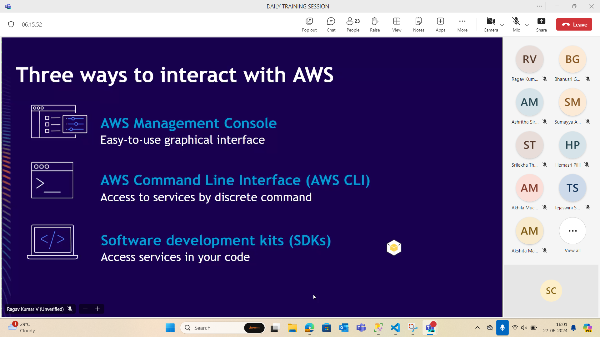

## AWS

## CDN

- Companies store data in nearby ares in order to deliver fastly when main line is cut off so whichever copy is fastest one that will be sent to the user.

- Cloudfare is the website which filter traffic and prevent DDOS attack.

- Firewall will be managed by Amazon Route 53

## Amazon EC2

- Its called as elastic cloud compute, and it is called elastic because we can increase the RAM easily by selecting from dropdown.

