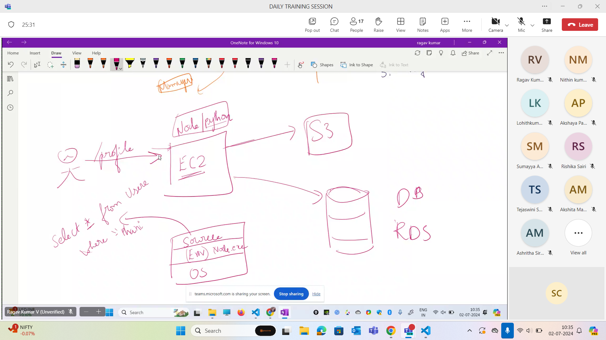

## AWS

- Amazon Route 53 is able to map url (domain name) to ip of EC2.
- Amazon EC2 instances there are two types of IPs static and dynamic IPs
- Amazon EBS has enivornment for source code,source code and OS 
- If i need to pull source code from github i need to have git nstall in Amazon EC2.
- Amazon S3 will have photos and videos because it's a cheap storage.

## Hosting 

- index.html file is required to keep 
- S3 buckets one of the use cases

- Auto restart is present in app server where the node js app can automaticaaly restart if multiple crashes are happening.
- Apache tomcat will automatically restart whenever the server crashes.
- Route 53 is used for setting up custom domain.

## AWS Lambda

- Give the source code, environment is already present, auto scaling is there if more load is there,If number of people reduces then lambda shuts down the system

