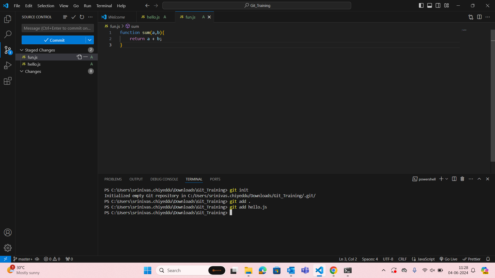
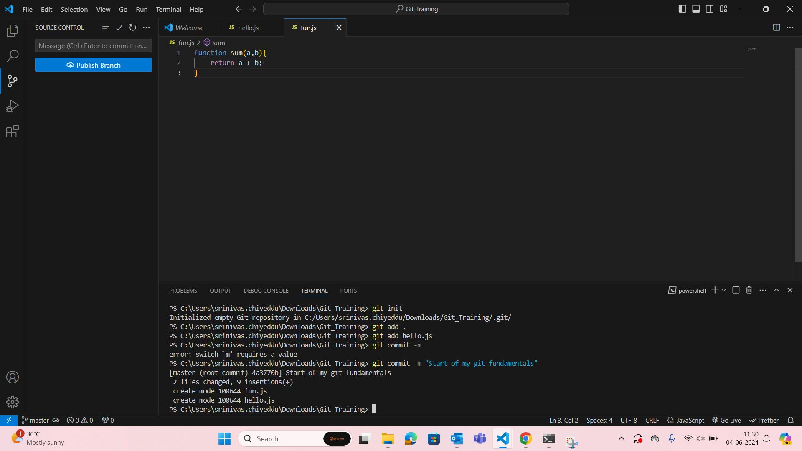
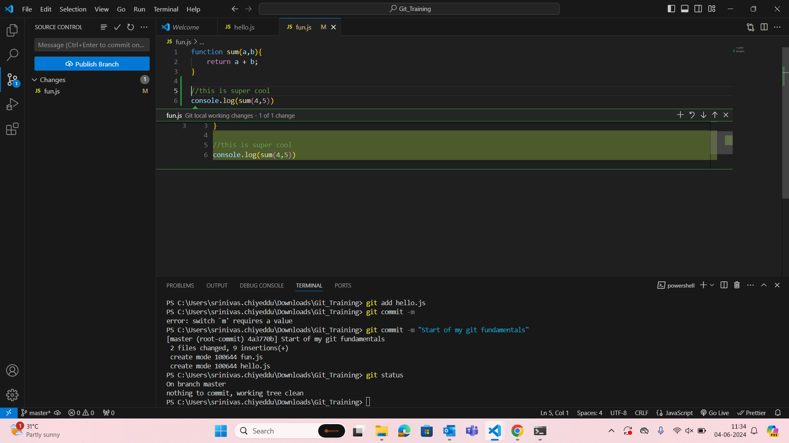
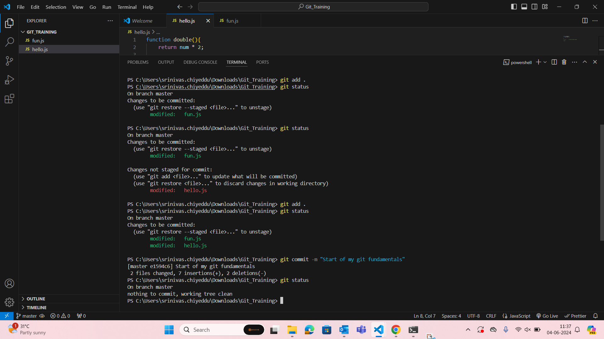
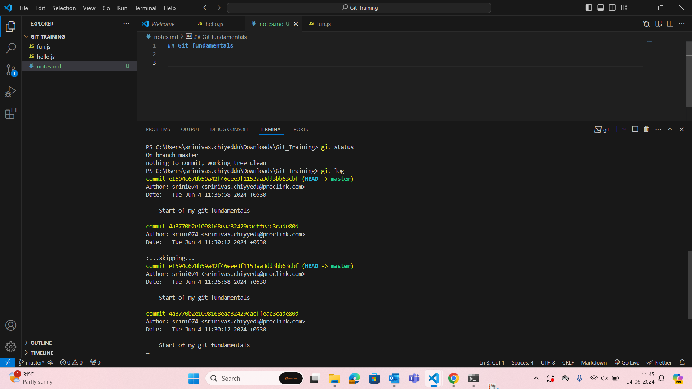
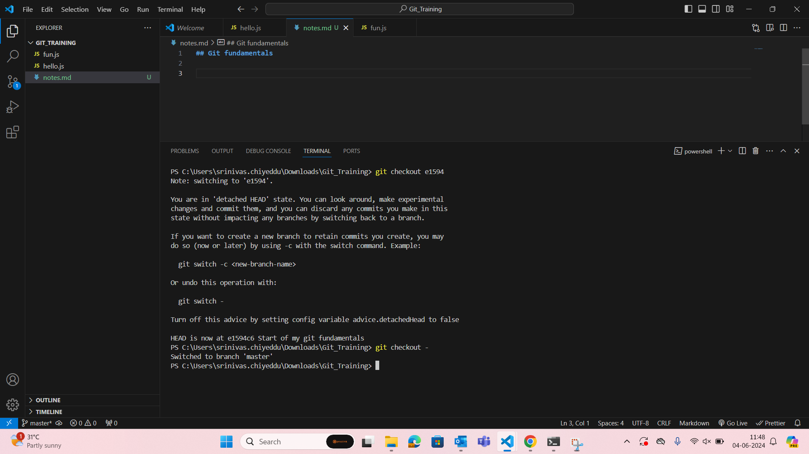
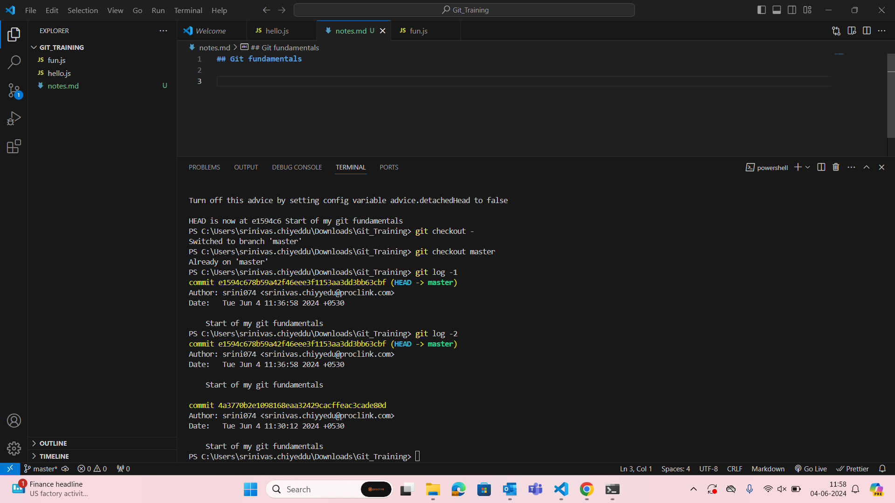
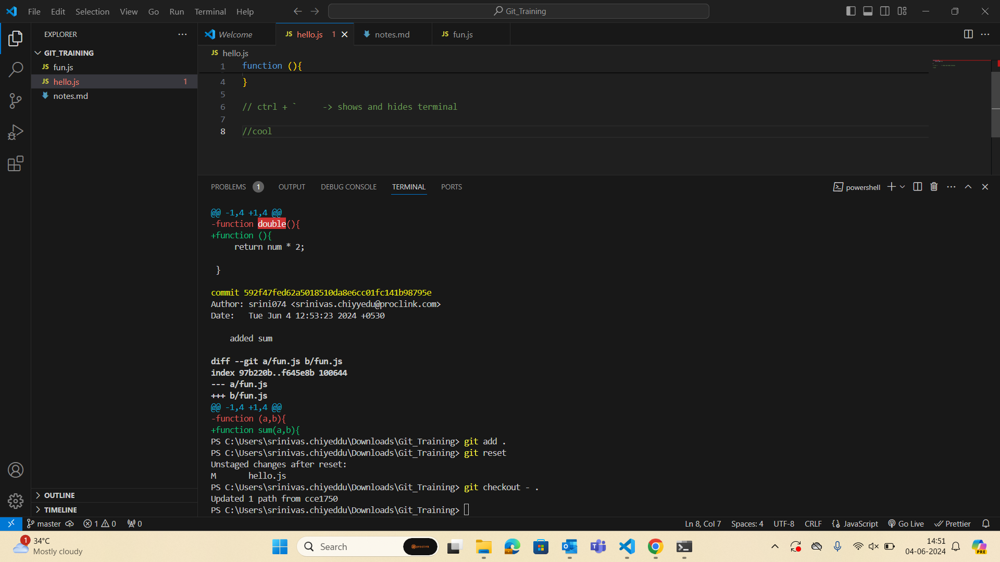
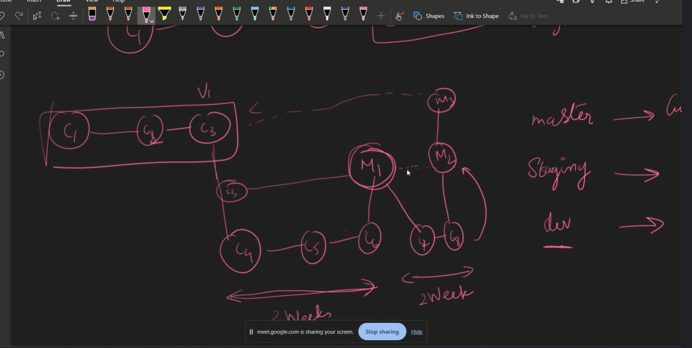

-  git init
-  git add .
-  git add ./hello.js ./fun.js
-  git commit -m "Start of my git fundamentals"
  

- To quit press q
- to go back to previous branch do git checkout -
- if you mess up the back button do git commit master

- git log -n 

-  n is the number of latest commits 

- git log --author=author_name

- git log --help 

- This will open a page in the browser

- git log -p
- This will show which lines have been modified

- 111  git commit -m "Testing with console"
- 112  git status
- 113  git log
- 114  git aa
- 115  git cm "Git notes"
- 116  git log
- 117  git checkout 601253fb4d
- 118  git checkout -
- 119  git log
- 120  git d60b04b716
- 121  git checkout d60b04b716
- 122  git checkout 601253fb4d
- 123  git checkout -
- 124  git checkout -
- 125  git checkout -
- 126  git checkout master
- 127  git checkout 601253fb4d
- 128  git checkout master
- 129  git log -1
- 130  git log -2_
- 131  git log --author=authot_name
- git branch --all // This command can be used to see all branches

- Pick axe command
- git log -S<word>

- git log -p 

-After pressing enter press '/' and then type <word> in patches
press 'n' to go to next match and press  'N' to go to previous match

- Git is a software and github is the place to store the code 

- Git staging area is needed because we can commit a single file 'A' once but also we can commit file 'A' with a group of files again.

## How to make commits to the git repository?

- Logical changes
- Small commits
- Multiple commits 
- Always commit when everything is working the code should work

## Example 

- HTML,CSS and JS for a code can be commited individually as 3 separate files

## Commit Message

- Commit message should explain why it worked. It should not be generic.

## How to unstage and discard changes

- git reset  // to unstage
- git checkout - .   // To discard the changes made to file

## Git revert

- git revert will remove any faultly added stuff , it will add a another commit to the previous faulty commit to remove the changes

- git reset --soft HEAD-1  // This will 

- git reset --hard HEAD-1  // This will completely remove the line and the history

- Verb + Number + Movement - Vim

## Number of branches in a git repo

- There are three branches in any code base

- 1)Master
- 2)Developer
- 3)Staging (Testing QA)

## Design Patterns

## Ahead and Behind branches

