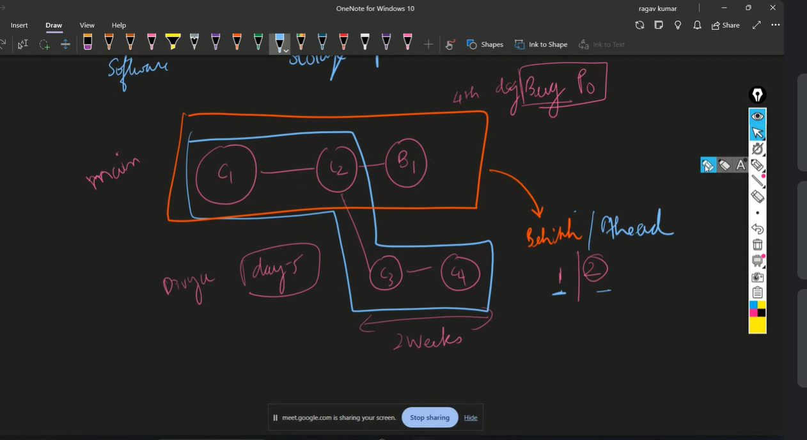

## Ahead and behind main branch

- When there a some 2 more commits in main branch done by other person then in our branch it shows 2 commits behind. Vice versa for ahead

## Semantic versioning (Sem Ver)

## How to create a conflict 

## git stash 

- git stash

- it temporarily hides the written code in a particular branch and then we can go to other branch and come back and then press 
- git stash apply 
- This will bring back the last stash

## Git rebase

-git rebase -i HEAD~4  
- Take last 3 commits atleast in order for it to work

- git rebase -i ( interactive rebase has 3 main features squash,drop and reword)

- git rebase --abort 
- to abort the rebase in between

- rebase should not be used on master/main branches

- git rebase is used to maintain the history in a straigh line ( fast forward merges). It will be easy to search using binary method in fast forward merges. Bugs can be found quickly in this way.
## Pull request

- feature to dev branch