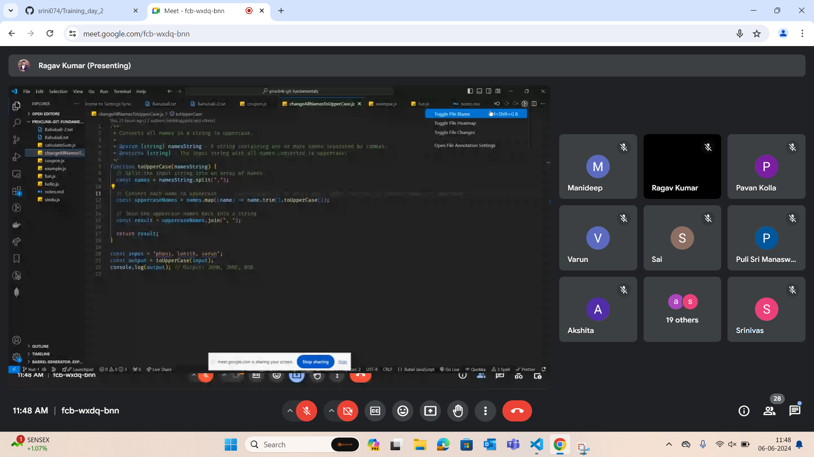
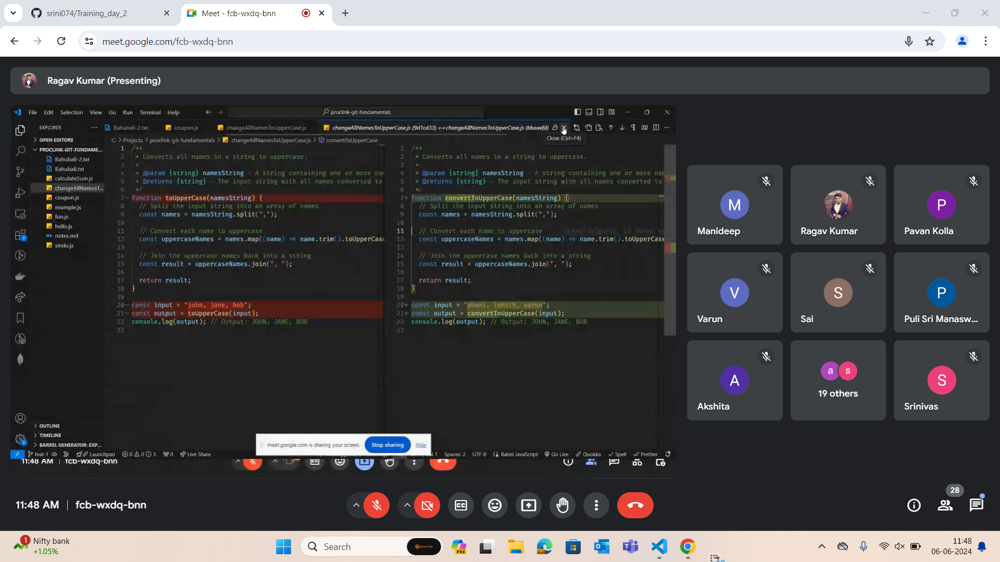
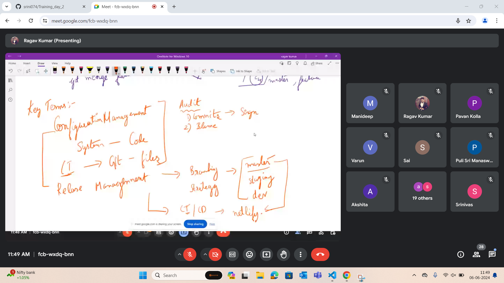
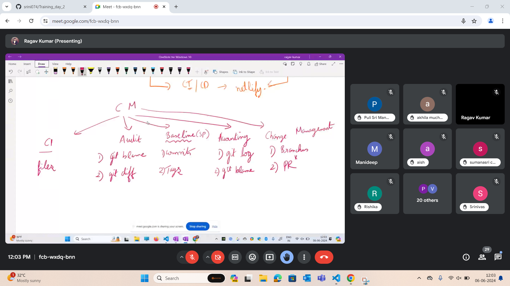
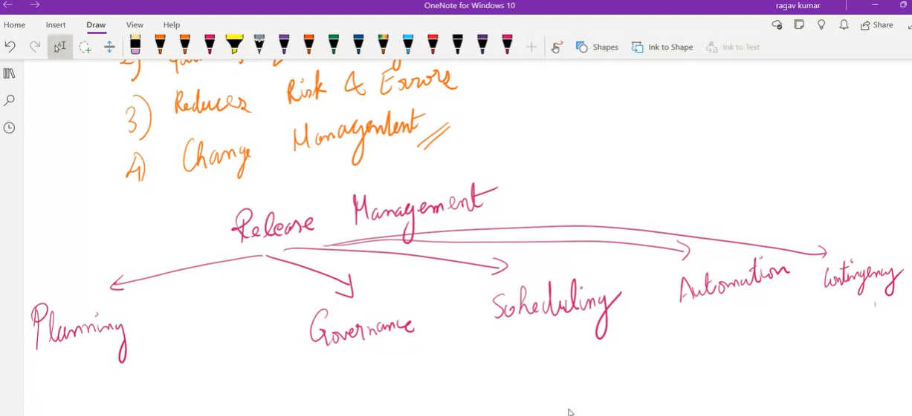
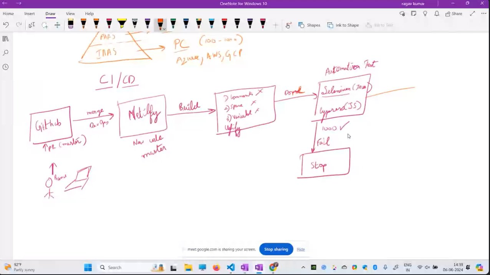
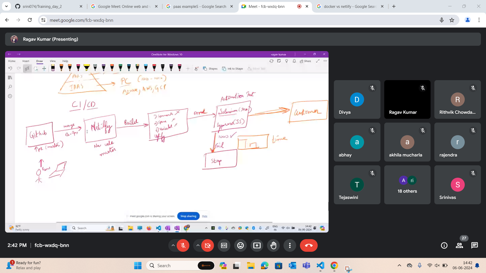
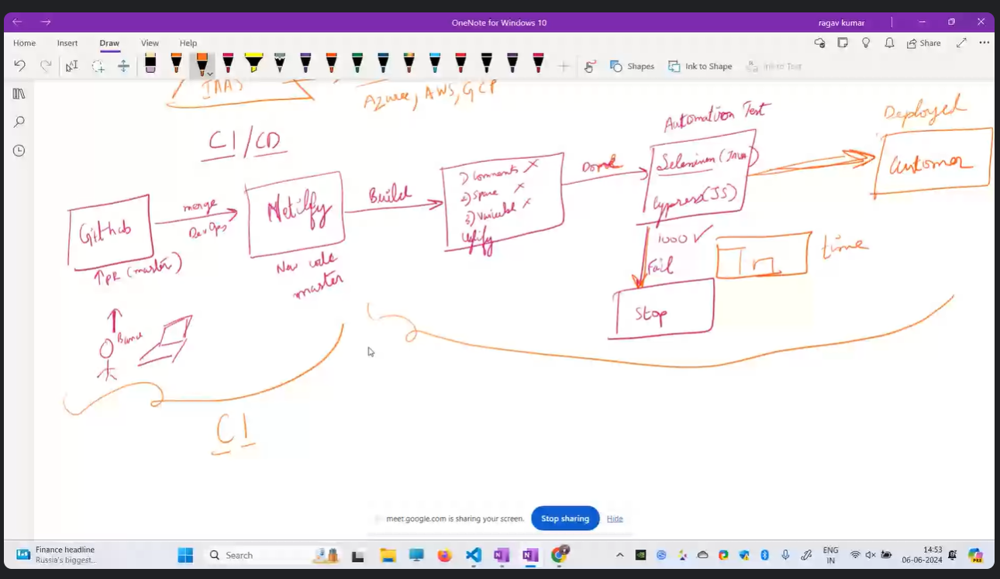
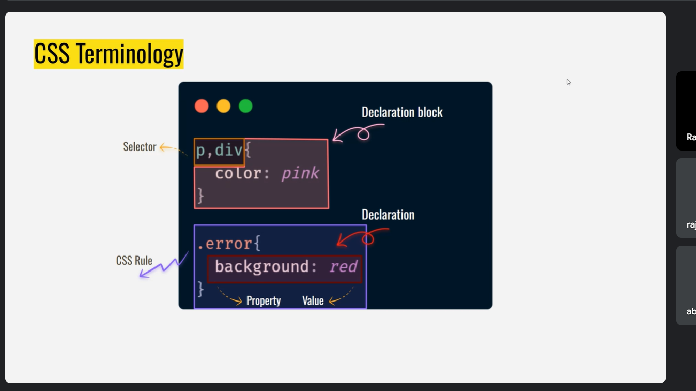
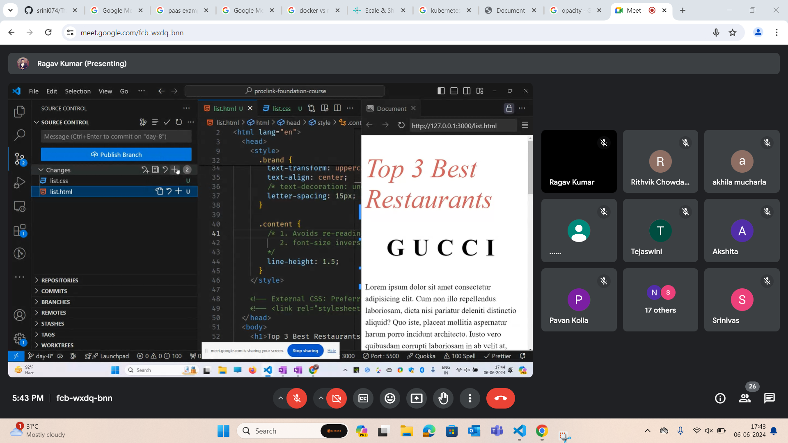

- git rebase is used to maintain the history in a straigh line ( fast forward merges). It will be easy to search using binary method in fast forward merges. Bugs can be found quickly in this way.

git bisect - to binary search commits 
## Pull request

- feature to dev branch

## First command to execute after coming to office

- git pull --rebase dev
- git pull --rebase origin dev
- This will pull the latest commits from online repository and rebase the extra branches

## Key Terms (business terminology)

- Git is a part of Configure management

- System - code
- Configuration item ( CI ) -----> Git files
- Release management ---> Branching stategies ---> Master branch, Staging branch for testing and dev branch.
- Release management ---> CI/CD - Continuos integration, continuos deployment ---> netlify (Master branch is linked to netlify)

- Major part of configuration management is the audit
- Frequent commits ---> Signing
- Git Blame ---> This is a feature where you can hover over a code to see who wrote the code at what time
- Also there is a command git blame which gives us the logs of every line of code and shows who wrote the lines at what time.

## Git Blame

## Configuration management

Benefits of configuration management are
- Traceability - Who? Why?
- Quality and consistency
- Reduces risks and errors
- Change management ( The process of bringing a change into the system to maintain the code quality , we create branches and PR)

## Release management

- There should be a proper plan when the release should happen.
- In order to implement the plan we have the branching strategy
- Governance talks about the access level of the each branch ( Staging access is restricted to developer)
- Scheduling is like there is a proper schedule and evry month we follow that schedule. ( Sprint and agile)
- Automation ( CI/CD is the automation part , in this testing could be on part)
- In automation when devops presses the button the netlify will automatically run the CI/CD and release it to customer. This will have no human errors.
- Contingency plan is a backup plan. Roll back to the previous version.

## How to maintain and automate release management with CI/CD

- Netlify , Jenkins, Circle CI

## SAAS, PAAS, IAAS

- Software as a service ( All the applications come under SAAS)
- Platform as a service ( They give the environment we have to write our to code to build apps. Examples are Netlify, render, heroku,  vercel)
- Infrastructure as a service ( They provide computers for rent and we have to install our own OS, frmaework, language and build apps. Examples are AWS, GCP)

## Flow

## Netlify

- Netlify comes under platform as a service ( PAAS ). It internally installs all the necessary dependencies to complete deployment. First step of deployment in netlify is git clone.

## Emmet Abbrevation

- ol>li*4 for ordered list 
- ( https://docs.emmet.io/cheat-sheet/ )
- Inside unordered list we can create an ordered list and vice versa.

- href="tel:" opens default dialer
- href="mailto:" opens compose mail
- Inline CSS, internal css and external css
- External css has a drawback that it has to make another http request in order to apply styles to html body whoch takes render time.

## CSS Terms

## Text Styling

- font-size ( fz is the emmet abbrevation )
- font-weight
- font-style
- font-family

## Color in CSS

- Color names
- Color code in RGB.
- Color name
- Hex value
- RGBA
- hsl - human friendly 
- lch - to get better color
In order to give color in rgba format we have to do 
color:rgba(80 88 92 /0.45)

- sRGB percentage represents to what percentage the monitor supports that sRGB colors. 

## Text Styling - II

- text - transform
- text - align
- text- decoration
- letter - spacing
- line - height

