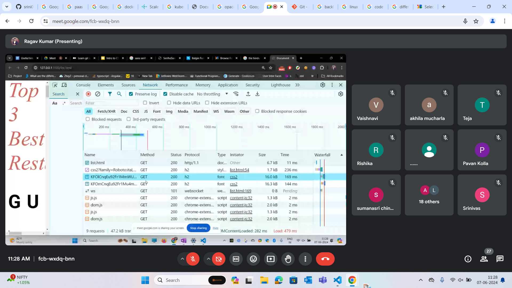

## Fonts 

- They are divided into serif and sans serif
- Don't add more than 2 fonts because it takes more loading time

## Mermaid tool

- https://mermaid.js.org/

## Box model

- It has margin>>border>>padding>>content in the order
- Complex properties are like padding-left,padding-right,padding-top and padding-bottom
- Border is also a complex property because it also has multiple options under it like border-left-width etc

## Minimum width

- We can use min-width and max-width properties to remove the scroll bar and make the container fit all screen sizes.

## vh and vw 

- 1 vh is 1% of screen height
- 1 vw is 1% of screen width
- 1% of container width is 
- 1px is an absolute unit 1% is a relative unit
