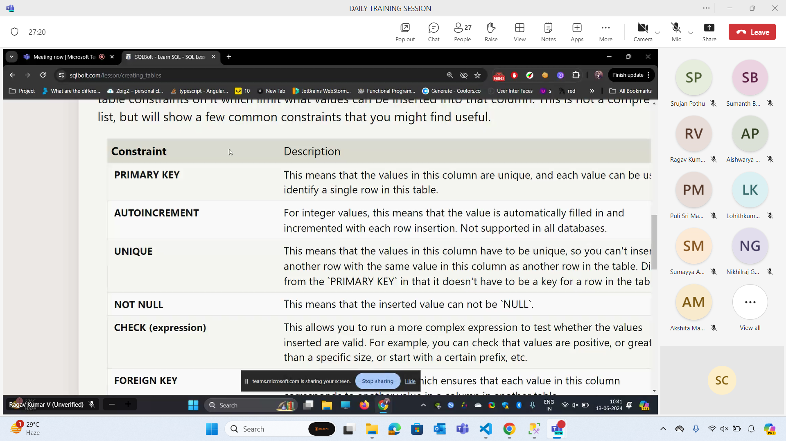
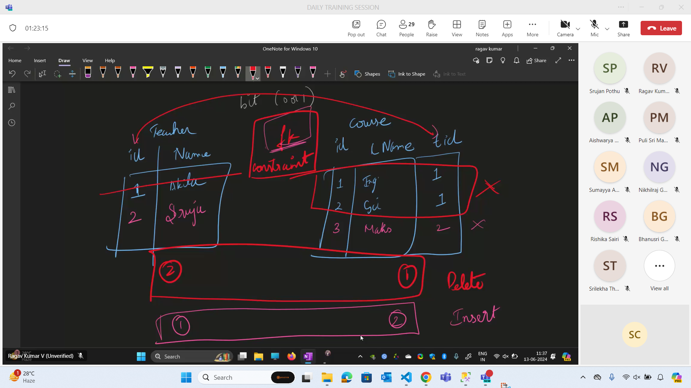
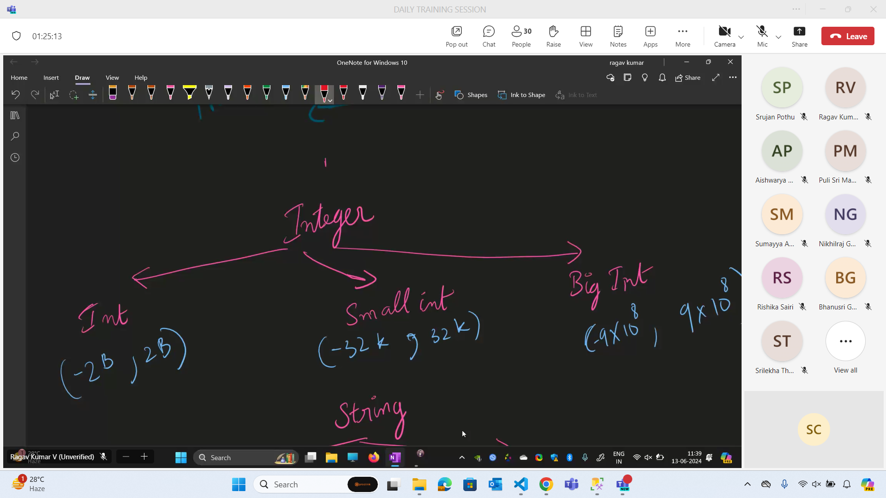
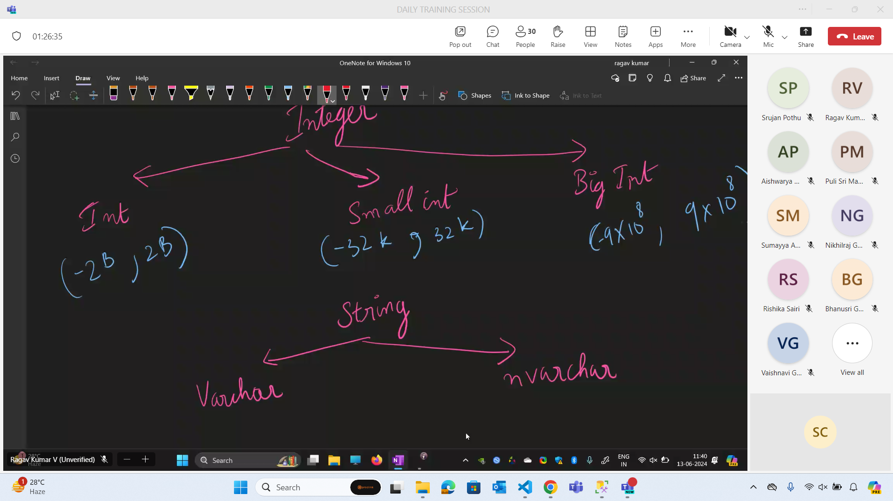
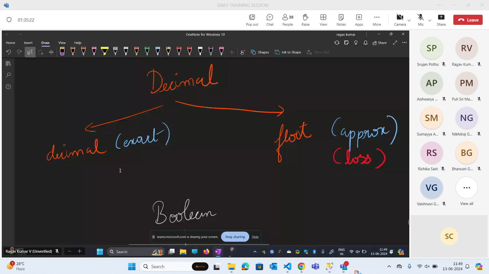
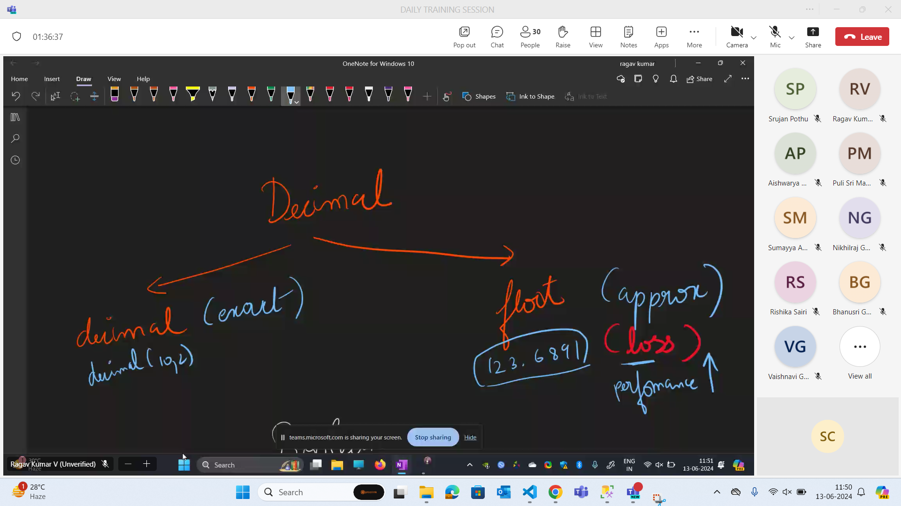
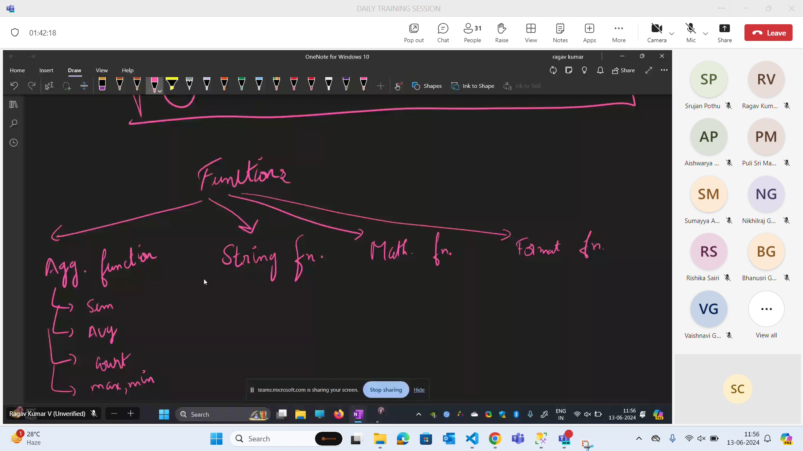

## Table 

## Primary key and foreign key

- Primary keys serve as unique identifiers for each row in a database table. Foreign keys link data in one table to the data in another table. A foreign key column in a table points to a column with unique values in another table (often the primary key column) to create a way of cross-referencing the two tables.

- If a column is assigned a foreign key, each row of that column must contain a value that exists in the ‘foreign’ column it references. The referenced (i.e. “foreign”) column must contain only unique values – often it is the primary key of its table.

- In short:

- Primary keys are used to uniquely identify and index each row within a single table.

- Foreign keys are used to link rows in two different tables such that a row can only be added or updated in table_a if the value in its foreign key column exists in the relevant column of table_b

## Constraints

- Whenever we are trying to insert a new value into the table it will trhow error.

## SQL Server Coding

- CREATE TABLE salesman (
    salesman_id INT PRIMARY KEY,
    name VARCHAR(255),
    city VARCHAR(255),
    commission DECIMAL(4, 2)
);

Select * from salesman

INSERT INTO salesman (salesman_id, name, city, commission) VALUES
(5001, 'James Hoog', 'New York', 0.15), -- Print
(5002, 'Nail Knite', 'Paris', 0.13),
(5005, 'Pit Alex', 'London', 0.11), -- Print
(5006, 'Mc Lyon', 'Paris', 0.14), -- Print
(5003, 'Lauson Hen', NULL, 0.12),
(5007, 'Paul Adam', 'Rome', 0.13); -- Print

SELECT AVG(commission) as av from salesman where city='Paris'

SELECT * FROM SALESMAN

SELECT city from salesman group by city having count(city)=1;

CREATE TABLE orders (
    ord_no INT PRIMARY KEY,
    purch_amt DECIMAL(10, 2),
    ord_date DATE,
    customer_id INT,
    salesman_id INT
);

INSERT INTO orders (ord_no, purch_amt, ord_date, customer_id, salesman_id) VALUES
(70001, 150.5, '2012-10-05', 3005, 5002),
(70009, 270.65, '2012-09-10', 3001, 5005),
(70002, 65.26, '2012-10-05', 3002, 5001),
(70004, 110.5, '2012-08-17', 3009, 5003),
(70007, 948.5, '2012-09-10', 3005, 5002),
(70005, 2400.6, '2012-07-27', 3007, 5001),
(70008, 5760, '2012-09-10', 3002, 5001),
(70010, 1983.43, '2012-10-10', 3004, 5006),
(70003, 2480.4, '2012-10-10', 3009, 5003),
(70012, 250.45, '2012-06-27', 3008, 5002),
(70011, 75.29, '2012-08-17', 3003, 5007),
(70013, 3045.6, '2012-04-25', 3002, 5001);

Select * from orders;

Select * from salesman

SELECT ord_no from orders
where salesman_id = (select salesman_id from salesman where name='Paul Adam');

SELECT ord_no from orders where ord_date='2012-10-10' and purch_amt > (select avg(purch_amt) from orders)

CREATE TABLE customer (
    customer_id INT PRIMARY KEY,
    cust_name VARCHAR(255),
    city VARCHAR(255),
    grade INT NULL,
    salesman_id INT
);
INSERT INTO customer (customer_id, cust_name, city, grade, salesman_id) VALUES
(3002, 'Nick Rimando', 'New York', 100, 5001),
(3005, 'Graham Zusi', 'California', 200, 5002),
(3001, 'Brad Guzan', 'London', NULL, 5005),
(3004, 'Fabian Johns', 'Paris', 300, 5006),
(3007, 'Brad Davis', 'New York', 200, 5001),
(3009, 'Geoff Camero', 'Berlin', 100, 5003),
(3008, 'Julian Green', 'London', 300, 5002),
(3003, 'Jozy Altidor', 'Moscow', 200, 5007);

select * from customer
select * from salesman
select * from orders

select orders.ord_no from salesman, orders where city = 'Paris' and salesman.salesman_id=orders.salesman_id;

select distinct s.name, c.salesman_id from salesman s Inner join customer c
On s.salesman_id = c.salesman_id
group by c.salesman_id,s.name
having count(c.salesman_id) > 1;

select city,count(city)
from salesman
where city is not null
group by city
having count(city)=1;

CREATE DATABASE shop;
Use shop;

Select Len('Rajendra') as NameLength

-- 2.left

Select Left('Rajendra',2) as NameLength
-- 3.Right

Select Right('Rajendra',2) as NameLength
-- 3.Substring

Select Substring('Rajendra',2,7) as NameLength
-- 3.Upper

Select Upper('Rajendra') as NameLength
-- 3.Lower

Select Lower('Rajendra') as NameLength
-- 3.Left
-- 3.Left

-- 6. Ltrim

Select Ltrim('      Rajendra') as NameLength

-- 6. RTrim

Select RTrim('Rajendra    ') as NameLength
-- 6. CharIndex

Select CharIndex('cool','This is cool') -- 9

Select CharIndex('awesome','This is cool') -- 0

-- 6. Replace

Select Replace('This is a fun day. Lets Enjoy the day','day','night') 

-- 6. Concat

Select Concat('Rajendra',' Super') as NameLength

-- 6. Replicate -  Repeat
Select Replicate('FunFriday ',5) as NameLength

-- 13. Reverse

Select Reverse('FunFriday')

-- Mathematical Functions

-- 1. Abs +ve
Select Abs (-5)
-- 2. Power 
Select Power(2,4)
-- 3. Round
Select Round(58,345,2)
-- 4.Ceiling
Select CEILING(58.345)
-- 5. Floor
Select Floor(58.345)

Date Functions

SalesOrderID	OrderDate	TotalAmount

(1001,2023-01-15 14:33:00,150.00)
(1002,2023-03-22 10:45:00,200.00)
(1003,2024-05-17 09:20:00,350.00)

CustomerID	CustomerName	Address

(201,'Acme Corp','123 Main St')
(202,'Globex Inc','456 Elm St')
(203,'Initech','789 Oak St')

## Excersices

- CREATE TABLE salesman (
    salesman_id INT PRIMARY KEY,
    name VARCHAR(255),
    city VARCHAR(255),
    commission DECIMAL(4, 2)
);

Select * from salesman

INSERT INTO salesman (salesman_id, name, city, commission) VALUES
(5001, 'James Hoog', 'New York', 0.15), -- Print
(5002, 'Nail Knite', 'Paris', 0.13),
(5005, 'Pit Alex', 'London', 0.11), -- Print
(5006, 'Mc Lyon', 'Paris', 0.14), -- Print
(5003, 'Lauson Hen', NULL, 0.12),
(5007, 'Paul Adam', 'Rome', 0.13); -- Print

SELECT AVG(commission) as av from salesman where city='Paris'

SELECT * FROM SALESMAN

SELECT city from salesman group by city having count(city)=1;

CREATE TABLE orders (
    ord_no INT PRIMARY KEY,
    purch_amt DECIMAL(10, 2),
    ord_date DATE,
    customer_id INT,
    salesman_id INT
);

INSERT INTO orders (ord_no, purch_amt, ord_date, customer_id, salesman_id) VALUES
(70001, 150.5, '2012-10-05', 3005, 5002),
(70009, 270.65, '2012-09-10', 3001, 5005),
(70002, 65.26, '2012-10-05', 3002, 5001),
(70004, 110.5, '2012-08-17', 3009, 5003),
(70007, 948.5, '2012-09-10', 3005, 5002),
(70005, 2400.6, '2012-07-27', 3007, 5001),
(70008, 5760, '2012-09-10', 3002, 5001),
(70010, 1983.43, '2012-10-10', 3004, 5006),
(70003, 2480.4, '2012-10-10', 3009, 5003),
(70012, 250.45, '2012-06-27', 3008, 5002),
(70011, 75.29, '2012-08-17', 3003, 5007),
(70013, 3045.6, '2012-04-25', 3002, 5001);

Select * from orders;

Select * from salesman

SELECT ord_no from orders
where salesman_id = (select salesman_id from salesman where name='Paul Adam');

SELECT ord_no from orders where ord_date='2012-10-10' and purch_amt > (select avg(purch_amt) from orders)

CREATE TABLE customer (
    customer_id INT PRIMARY KEY,
    cust_name VARCHAR(255),
    city VARCHAR(255),
    grade INT NULL,
    salesman_id INT
);
INSERT INTO customer (customer_id, cust_name, city, grade, salesman_id) VALUES
(3002, 'Nick Rimando', 'New York', 100, 5001),
(3005, 'Graham Zusi', 'California', 200, 5002),
(3001, 'Brad Guzan', 'London', NULL, 5005),
(3004, 'Fabian Johns', 'Paris', 300, 5006),
(3007, 'Brad Davis', 'New York', 200, 5001),
(3009, 'Geoff Camero', 'Berlin', 100, 5003),
(3008, 'Julian Green', 'London', 300, 5002),
(3003, 'Jozy Altidor', 'Moscow', 200, 5007);

select * from customer
select * from salesman
select * from orders

select orders.ord_no from salesman, orders where city = 'Paris' and salesman.salesman_id=orders.salesman_id;

select distinct s.name, c.salesman_id from salesman s Inner join customer c
On s.salesman_id = c.salesman_id
group by c.salesman_id,s.name
having count(c.salesman_id) > 1;

select city,count(city)
from salesman
where city is not null
group by city
having count(city)=1;

CREATE DATABASE shop;
Use shop;

Select Len('Rajendra') as NameLength

-- 2.left

Select Left('Rajendra',2) as NameLength
-- 3.Right

Select Right('Rajendra',2) as NameLength
-- 3.Substring

Select Substring('Rajendra',2,7) as NameLength
-- 3.Upper

Select Upper('Rajendra') as NameLength
-- 3.Lower

Select Lower('Rajendra') as NameLength
-- 3.Left
-- 3.Left

-- 6. Ltrim

Select Ltrim('      Rajendra') as NameLength

-- 6. RTrim

Select RTrim('Rajendra    ') as NameLength
-- 6. CharIndex

Select CharIndex('cool','This is cool') -- 9

Select CharIndex('awesome','This is cool') -- 0

-- 6. Replace

Select Replace('This is a fun day. Lets Enjoy the day','day','night') 

-- 6. Concat

Select Concat('Rajendra',' Super') as NameLength

-- 6. Replicate -  Repeat
Select Replicate('FunFriday ',5) as NameLength

-- 13. Reverse

Select Reverse('FunFriday')

-- Mathematical Functions

-- 1. Abs +ve
Select Abs (-5)
-- 2. Power 
Select Power(2,4)
-- 3. Round
Select Round(58,345,2)
-- 4.Ceiling
Select CEILING(58.345)
-- 5. Floor
Select Floor(58.345)

-- Date Functions

-- 1. GetDate
select GETDATE() as Today
-- 2. DateAdd
select DateAdd(day,10,GETDATE()) 
-- 3. DateDiff
select DateDiff(YEAR,getdate(),'2023-06-23')
-- 4. Format
select FORMAT(GETDATE(),'MM/dd/yyyy');
-- 5. DatePart (Extract the part from the date)

Select DATEPART(month,GETDATE())
Select DATEPART(DAY, GETDATE())

CREATE DATABASE Excersice

Use Excersice

CREATE TABLE EmployeesTable(
EmployeeID INT PRIMARY KEY,
FirstName VARCHAR(255),
LastName VARCHAR(255),
);

INSERT INTO EmployeesTable VALUES
(1,'John',' Doe'),
(2,'Jane',' Smith'),
(3,'Alice',' Johnson');
DROP TABLE EmployeesTable
CREATE TABLE ProductsTable(
ProductID INT PRIMARY KEY,
ProductName VARCHAR(255),
ProductDescription VARCHAR(255),
);

DROP TABLE EmployeesTable
DROP TABLE ProductsTable
INSERT INTO ProductsTable VALUES
(101,'Widget A','A standard widget'),
(102,'Gadget B','A fancy new gadget'),
(103,'Thingamajig','A very useful tool');

CREATE TABLE SalesOrder(
SalesOrderID INT PRIMARY KEY,
OrderDate DATETIME,
TotalAmount FLOAT,
);

INSERT INTO SalesOrder VALUES
(1001,'2023-01-15 14:33:00',150.00),
(1002,'2023-03-22 10:45:00',200.00),
(1003,'2024-05-17 09:20:00',350.00)

CREATE TABLE Customers(
CustomerID INT PRIMARY KEY,
CustomerName VARCHAR(255),
Address VARCHAR(255),
);

INSERT INTO Customers VALUES
(201,'Acme Corp','123 Main St'),
(202,'Globex Inc','456 Elm St'),
(203,'Initech','789 Oak St')

SELECT * FROM EmployeesTable

SELECT * FROM ProductsTable

SELECT * FROM SalesOrder

SELECT * FROM Customers

SELECT EmployeeID,upper(concat(FirstName,LastName)) AS FullName from EmployeesTable

SELECT ProductID,ProductName,len(ProductDescription) AS DescriptionLength from ProductsTable

- CREATE TABLE salesman (
    salesman_id INT PRIMARY KEY,
    name VARCHAR(255),
    city VARCHAR(255),
    commission DECIMAL(4, 2)
);

Select * from salesman

INSERT INTO salesman (salesman_id, name, city, commission) VALUES
(5001, 'James Hoog', 'New York', 0.15), -- Print
(5002, 'Nail Knite', 'Paris', 0.13),
(5005, 'Pit Alex', 'London', 0.11), -- Print
(5006, 'Mc Lyon', 'Paris', 0.14), -- Print
(5003, 'Lauson Hen', NULL, 0.12),
(5007, 'Paul Adam', 'Rome', 0.13); -- Print

SELECT AVG(commission) as av from salesman where city='Paris'

SELECT * FROM SALESMAN

SELECT city from salesman group by city having count(city)=1;

CREATE TABLE orders (
    ord_no INT PRIMARY KEY,
    purch_amt DECIMAL(10, 2),
    ord_date DATE,
    customer_id INT,
    salesman_id INT
);

INSERT INTO orders (ord_no, purch_amt, ord_date, customer_id, salesman_id) VALUES
(70001, 150.5, '2012-10-05', 3005, 5002),
(70009, 270.65, '2012-09-10', 3001, 5005),
(70002, 65.26, '2012-10-05', 3002, 5001),
(70004, 110.5, '2012-08-17', 3009, 5003),
(70007, 948.5, '2012-09-10', 3005, 5002),
(70005, 2400.6, '2012-07-27', 3007, 5001),
(70008, 5760, '2012-09-10', 3002, 5001),
(70010, 1983.43, '2012-10-10', 3004, 5006),
(70003, 2480.4, '2012-10-10', 3009, 5003),
(70012, 250.45, '2012-06-27', 3008, 5002),
(70011, 75.29, '2012-08-17', 3003, 5007),
(70013, 3045.6, '2012-04-25', 3002, 5001);

Select * from orders;

Select * from salesman

SELECT ord_no from orders
where salesman_id = (select salesman_id from salesman where name='Paul Adam');

SELECT ord_no from orders where ord_date='2012-10-10' and purch_amt > (select avg(purch_amt) from orders)

CREATE TABLE customer (
    customer_id INT PRIMARY KEY,
    cust_name VARCHAR(255),
    city VARCHAR(255),
    grade INT NULL,
    salesman_id INT
);
INSERT INTO customer (customer_id, cust_name, city, grade, salesman_id) VALUES
(3002, 'Nick Rimando', 'New York', 100, 5001),
(3005, 'Graham Zusi', 'California', 200, 5002),
(3001, 'Brad Guzan', 'London', NULL, 5005),
(3004, 'Fabian Johns', 'Paris', 300, 5006),
(3007, 'Brad Davis', 'New York', 200, 5001),
(3009, 'Geoff Camero', 'Berlin', 100, 5003),
(3008, 'Julian Green', 'London', 300, 5002),
(3003, 'Jozy Altidor', 'Moscow', 200, 5007);

select * from customer
select * from salesman
select * from orders

select orders.ord_no from salesman, orders where city = 'Paris' and salesman.salesman_id=orders.salesman_id;

select distinct s.name, c.salesman_id from salesman s Inner join customer c
On s.salesman_id = c.salesman_id
group by c.salesman_id,s.name
having count(c.salesman_id) > 1;

select city,count(city)
from salesman
where city is not null
group by city
having count(city)=1;

CREATE DATABASE shop;
Use shop;

Select Len('Rajendra') as NameLength

-- 2.left

Select Left('Rajendra',2) as NameLength
-- 3.Right

Select Right('Rajendra',2) as NameLength
-- 3.Substring

Select Substring('Rajendra',2,7) as NameLength
-- 3.Upper

Select Upper('Rajendra') as NameLength
-- 3.Lower

Select Lower('Rajendra') as NameLength
-- 3.Left
-- 3.Left

-- 6. Ltrim

Select Ltrim('      Rajendra') as NameLength

-- 6. RTrim

Select RTrim('Rajendra    ') as NameLength
-- 6. CharIndex

Select CharIndex('cool','This is cool') -- 9

Select CharIndex('awesome','This is cool') -- 0

-- 6. Replace

Select Replace('This is a fun day. Lets Enjoy the day','day','night') 

-- 6. Concat

Select Concat('Rajendra',' Super') as NameLength

-- 6. Replicate -  Repeat
Select Replicate('FunFriday ',5) as NameLength

-- 13. Reverse

Select Reverse('FunFriday')

-- Mathematical Functions

-- 1. Abs +ve
Select Abs (-5)
-- 2. Power 
Select Power(2,4)
-- 3. Round
Select Round(58,345,2)
-- 4.Ceiling
Select CEILING(58.345)
-- 5. Floor
Select Floor(58.345)

-- Date Functions

-- 1. GetDate
select GETDATE() as Today
-- 2. DateAdd
select DateAdd(day,10,GETDATE()) 
-- 3. DateDiff
select DateDiff(YEAR,getdate(),'2023-06-23')
-- 4. Format
select FORMAT(GETDATE(),'MM/dd/yyyy');
-- 5. DatePart (Extract the part from the date)

Select DATEPART(month,GETDATE())
Select DATEPART(DAY, GETDATE())

CREATE DATABASE Excersice

Use Excersice

CREATE TABLE EmployeesTable(
EmployeeID INT PRIMARY KEY,
FirstName VARCHAR(255),
LastName VARCHAR(255),
);

INSERT INTO EmployeesTable VALUES
(1,'John',' Doe'),
(2,'Jane',' Smith'),
(3,'Alice',' Johnson');
DROP TABLE EmployeesTable
CREATE TABLE ProductsTable(
ProductID INT PRIMARY KEY,
ProductName VARCHAR(255),
ProductDescription VARCHAR(255),
);

DROP TABLE EmployeesTable
DROP TABLE ProductsTable
INSERT INTO ProductsTable VALUES
(101,'Widget A','A standard widget'),
(102,'Gadget B','A fancy new gadget'),
(103,'Thingamajig','A very useful tool');

CREATE TABLE SalesOrder(
SalesOrderID INT PRIMARY KEY,
OrderDate DATETIME,
TotalAmount FLOAT,
);

INSERT INTO SalesOrder VALUES
(1001,'2023-01-15 14:33:00',150.00),
(1002,'2023-03-22 10:45:00',200.00),
(1003,'2024-05-17 09:20:00',350.00)

CREATE TABLE Customers(
CustomerID INT PRIMARY KEY,
CustomerName VARCHAR(255),
Address VARCHAR(255),
);

INSERT INTO Customers VALUES
(201,'Acme Corp','123 Main St'),
(202,'Globex Inc','456 Elm St'),
(203,'Initech','789 Oak St')

SELECT * FROM EmployeesTable

SELECT * FROM ProductsTable

SELECT * FROM SalesOrder

SELECT * FROM Customers

-- EX-1
SELECT EmployeeID,upper(concat(FirstName,LastName)) AS FullName from EmployeesTable
-- EX-2
SELECT ProductID,ProductName,len(ProductDescription) AS DescriptionLength from ProductsTable
-- EX-3
SELECT SalesOrderID,FORMAT(OrderDate,'yyyy-mm-dd') AS FormattedOrderDate from SalesOrder
-- EX-4
SELECT CustomerID,CustomerName,rTrim(Ltrim(Address)) AS CleanedAddress from Customers
-- EX-5
SELECT datepart(year,OrderDate) as Year,sum(TotalAmount) as TotalSales from SalesOrder group by datepart(year,OrderDate)

EmployeeID	FirstName	LastName	DepartmentID

(1,'John','Doe',101)
(2,'Jane','Smith',102)
(3,'Alice','Johnson',103)

DepartmentID	DepartmentName

(101,'Sales')
(102,'Engineering')
(103,'Marketing')

